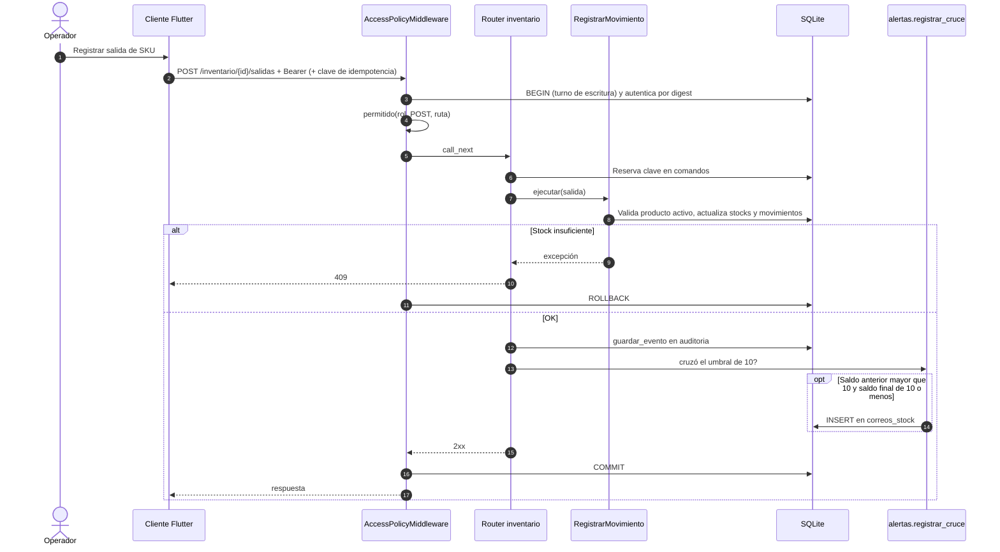
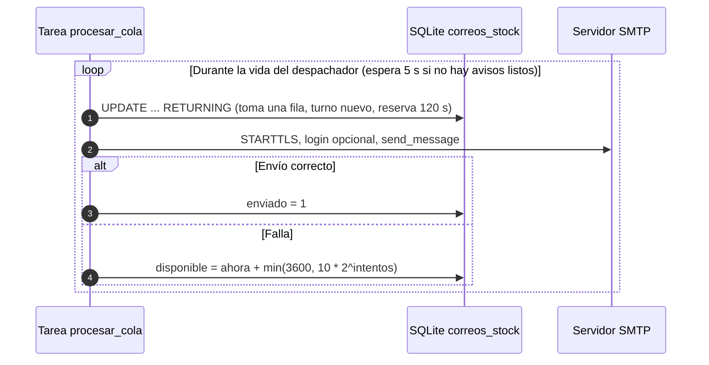
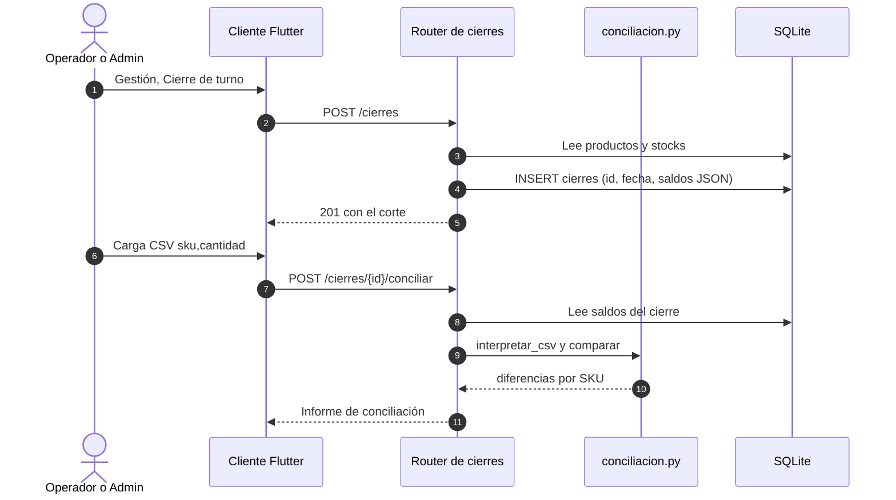
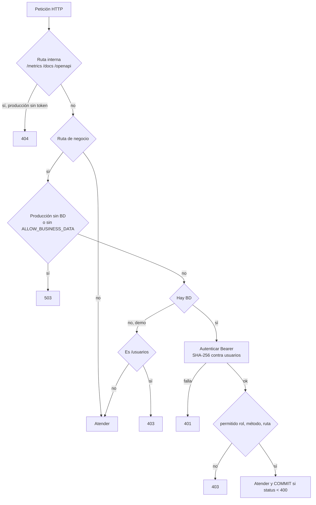

# Complementario · Flujos dinámicos

## 1. Salida de stock (perfil durable)

```mermaid
sequenceDiagram
    autonumber
    actor Op as Operador
    participant App as Cliente Flutter
    participant Mw as AccessPolicyMiddleware
    participant R as Router inventario
    participant UC as RegistrarMovimiento
    participant DB as SQLite
    participant Al as alertas.registrar_cruce

    Op->>App: Registrar salida de SKU
    App->>Mw: POST /inventario/{id}/salidas + Bearer (+ clave de idempotencia)
    Mw->>DB: BEGIN (turno de escritura) y autentica por digest
    Mw->>Mw: permitido(rol, POST, ruta)
    Mw->>R: call_next
    R->>DB: Reserva clave en comandos
    R->>UC: ejecutar(salida)
    UC->>DB: Valida producto activo, actualiza stocks y movimientos
    alt Stock insuficiente
        UC-->>R: excepción
        R-->>App: 409
        Mw->>DB: ROLLBACK
    else OK
        R->>DB: guardar_evento en auditoria
        R->>Al: cruzó el umbral de 10?
        opt Saldo anterior mayor que 10 y saldo final de 10 o menos
            Al->>DB: INSERT en correos_stock
        end
        R-->>Mw: 2xx
        Mw->>DB: COMMIT
        Mw-->>App: respuesta
    end
```

## 2. Alerta de stock bajo por correo

```mermaid
sequenceDiagram
    autonumber
    participant T as Tarea procesar_cola
    participant DB as SQLite correos_stock
    participant S as Servidor SMTP

    loop Durante la vida del despachador (espera 5 s si no hay avisos listos)
        T->>DB: UPDATE ... RETURNING (toma una fila, turno nuevo, reserva 120 s)
        T->>S: STARTTLS, login opcional, send_message
        alt Envío correcto
            T->>DB: enviado = 1
        else Falla
            T->>DB: disponible = ahora + min(3600, 10 * 2^intentos)
        end
    end
```

## 3. Cierre de turno y conciliación

```mermaid
sequenceDiagram
    autonumber
    actor Op as Operador o Admin
    participant App as Cliente Flutter
    participant C as Router de cierres
    participant K as conciliacion.py
    participant DB as SQLite

    Op->>App: Gestión, Cierre de turno
    App->>C: POST /cierres
    C->>DB: Lee productos y stocks
    C->>DB: INSERT cierres (id, fecha, saldos JSON)
    C-->>App: 201 con el corte
    Op->>App: Carga CSV sku,cantidad
    App->>C: POST /cierres/{id}/conciliar
    C->>DB: Lee saldos del cierre
    C->>K: interpretar_csv y comparar
    K-->>C: diferencias por SKU
    C-->>App: Informe de conciliación
```

## 4. Política de acceso

```mermaid
flowchart TD
    A[Petición HTTP] --> B{Ruta interna<br/>/metrics /docs /openapi}
    B -- sí, producción sin token --> X404[404]
    B -- no --> C{Ruta de negocio}
    C -- no --> OK[Atender]
    C -- sí --> D{Producción sin BD<br/>o sin ALLOW_BUSINESS_DATA}
    D -- sí --> X503[503]
    D -- no --> E{Hay BD}
    E -- no, demo --> F{Es /usuarios}
    F -- sí --> X403[403]
    F -- no --> OK
    E -- sí --> G[Autenticar Bearer<br/>SHA-256 contra usuarios]
    G -- falla --> X401[401]
    G -- ok --> H{permitido rol, método, ruta}
    H -- no --> X403b[403]
    H -- sí --> I[Atender y COMMIT si status < 400]
```
