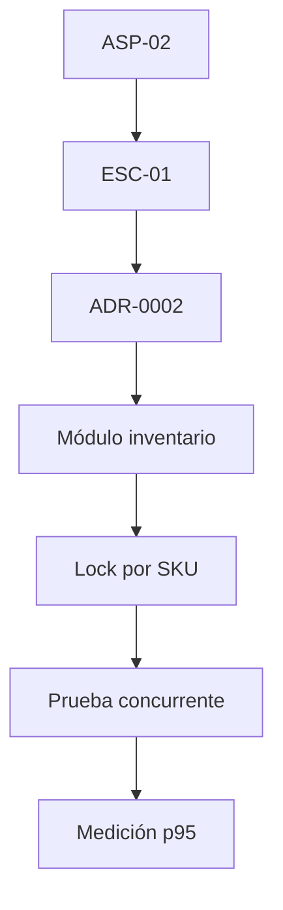

# ADR-0002: Control de Concurrencia y Aislamiento en Memoria para el Módulo de Inventario

- **Estado:** Aceptado
- **Fecha:** 2026-09-06
- **Contexto y Diagnóstico:** En el marco del Reto del Primer Corte (AS_202620), se requiere garantizar que ante un pico de concurrencia de 20 usuarios simultáneos reduciendo stock sobre el mismo producto (SKU), el sistema mantenga la consistencia estricta de inventario con una latencia $p95 \le 400\text{ ms}$.
  - **Síntoma:** Apertura a *dirty writes* y stock negativo ante escrituras simultáneas sobre el mismo recurso.
  - **Causa Raíz:** Ausencia de serialización asíncrona sobre los repositorios en memoria en operaciones concurrentes de actualización.
  - **Riesgo Prioritario:** Corrupción del saldo de inventarios y pérdida de confiabilidad en la regla central del negocio.

---

## Alternativas Evaluadas

1. **Pessimistic Locking en Base de Datos (`SELECT FOR UPDATE`):**
   - *Ventajas:* Garantiza aislamiento estricto en motores SQL relacionales.
   - *Desventajas:* Añade acoplamiento y sobrecoste de I/O a una persistencia relacional que aún no está integrada en la etapa MVP.

2. **Optimistic Locking con Versionamiento / ETag:**
   - *Ventajas:* Bajo costo de lectura, no requiere bloqueos de hilos o corrutinas.
   - *Desventajas:* Bajo contención severa (20 peticiones simultáneas sobre el mismo milisegundo) genera alta tasa de reintentos y errores HTTP `409 Conflict`, degradando la latencia $p95$.

3. **Mecanismo de Exclusión Mutua en Memoria (Mutex/Lock asíncrono por SKU):**
   - *Ventajas:* Serializa atómicamente el procesamiento de las peticiones concurrentes a nivel del caso de uso / aplicación mediante `asyncio.Lock()`. Cero dependencias externas y latencia ultra baja ($p95 = 28\text{ ms}$).
   - *Desventajas:* Válido y efectivo únicamente dentro de un proceso / instancia individual de la aplicación.

---

## Decisión

Adoptar la **Opción 3 (Mutex/Lock asíncrono por SKU)** para el corte vertical actual. La lógica de negocio del módulo de `inventario` coordinará las actualizaciones de stock asegurando la ejecución atómica sin requerir componentes ni servicios externos.

---

## Consecuencias y Límites

- **Consecuencias Positivas:** Cumple holgadamente el umbral de rendimiento ($p95 = 28\text{ ms} \ll 400\text{ ms}$), elimina condiciones de carrera de stock negativo y preserva la simplicidad del Monolito Modular.
- **Manejo de Degradación:** Si se alcanza una saturación de concurrencia sobre el cerrojo, el sistema encola peticiones en el *event loop* de FastAPI o responde con códigos HTTP `429` / `503` controlados sin comprometer la integridad del stock.

---

## Gobernanza, Criterios de Revisión y Costo de Reversión

* **Gobernanza y Criterios de Revisión:** Esta decisión de arquitectura **se revisará automáticamente** cuando el sistema se despliegue en un entorno distribuido horizontalmente (múltiples réplicas/contenedores de FastAPI detrás de un balanceador de carga), donde un cerrojo en memoria local de Python pierda efectividad entre instancias.
* **Costo de Reversión:** Es **mínimo**. Debido al patrón de Puertos y Adaptadores (Arquitectura Hexagonal), la migración solo exigirá reemplazar la implementación del adaptador en la capa de infraestructura por un cerrojo distribuido (ej. *Redis Distributed Lock / Redlock*). Las capas de Aplicación, Dominio y las Pruebas de Unidad permanecerán 100% intactas.

---

## Trazabilidad

