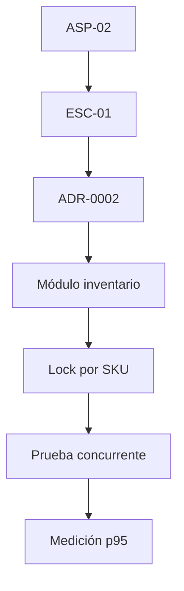

# ADR-0002: Control de Concurrencia y Aislamiento en Memoria para el Módulo de Inventario

- **Estado:** Aceptado
- **Fecha:** 2026-09-06
- **Contexto:** En el marco del Reto del Primer Corte (AS_202620), se requiere garantizar que ante un pico de concurrencia de 20 usuarios simultáneos reduciendo stock sobre el mismo producto (SKU), el sistema garantice un tiempo de respuesta $p95 \le 400\text{ ms}$ y mantenga la consistencia estricta de stock sin condiciones de carrera (*race conditions*).

## Alternativas Evaluadas

1. **Pessimistic Locking en Base de Datos (`SELECT FOR UPDATE`):**
   - *Ventajas:* Garantiza aislamiento estricto en motores SQL relacionales.
   - *Desventajas:* Depende de la presencia de un motor de persistencia relacional que aún no está integrado en el esqueleto actual del MVP.

2. **Optimistic Locking con Versionamiento / ETag:**
   - *Ventajas:* Bajo costo de lectura, no requiere bloqueos de hilos o corrutinas.
   - *Desventajas:* Bajo contención severa (20 peticiones simultáneas sobre el mismo milisegundo) genera alta tasa de reintentos y errores 409 (Conflict), degradando significativamente la latencia $p95$.

3. **Mecanismo de Exclusión Mutua en Memoria (Mutex/Lock asíncrono por SKU):**
   - *Ventajas:* Serializa atómicamente el procesamiento de las peticiones concurrentes a nivel del caso de uso / aplicación mediante `asyncio.Lock()`. Cero dependencias externas e impacto mínimo en latencia ($< 50\text{ ms}$).
   - *Desventajas:* Efectivo únicamente dentro de una sola instancia de ejecución del backend.

## Decisión

Adoptar la **Opción 3 (Mutex/Lock asíncrono por SKU)** para el corte vertical actual. La lógica de negocio del módulo de `inventario` coordinará las actualizaciones de stock asegurando la ejecución atómica sin requerir componentes externos.

## Consecuencias y Límites

- **Consecuencias Positivas:** Cumple holgadamente el umbral de rendimiento ($p95 \le 400\text{ ms}$), elimina *race conditions* de stock negativo en entornos de una sola instancia y mantiene simple la arquitectura del Monolito Modular.
- **Límites / Costo de Reversión:** Si la aplicación escala horizontalmente a múltiples réplicas/contenedores de FastAPI, este mecanismo deberá ser reemplazado por un cerrojo distribuido (ej. Redis Distributed Lock) o cierres a nivel de Base de Datos SQL, cuya migración estará encapsulada dentro de los adaptadores de infraestructura sin alterar la capa de dominio.

## Trazabilidad

