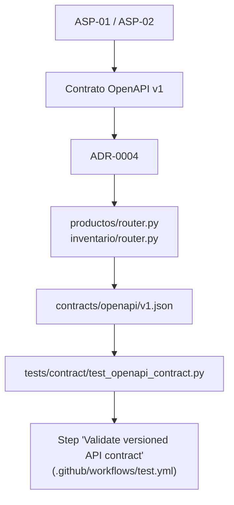

# ADR-0004: Contrato de API versionado con OpenAPI

- **Estado:** Aceptado
- **Fecha:** 2026-09-19
- **Decisores:** Equipo InvenTrack

## Contexto

La API ya expone un contrato OpenAPI generado por FastAPI, pero ese contrato
no estaba almacenado como artefacto versionado ni se validaba en el pipeline.
Un cambio accidental en una ruta, un modelo o un código HTTP podía llegar a
la rama principal sin una señal explícita para los consumidores de la API.

## Alternativas consideradas

1. **No versionar el contrato.** Se descarta porque deja la compatibilidad
   dependiente de la implementación actual y dificulta revisar cambios.
2. **Usar Pact desde esta etapa.** Se descarta por ahora: el proyecto tiene
   un único backend y todavía no existen consumidores independientes que
   publiquen contratos propios ni un broker de Pact.
3. **Versionar y validar OpenAPI.** Se adopta porque FastAPI ya genera la
   especificación, es legible por herramientas estándar y cubre el contrato
   proveedor de la API sin añadir infraestructura operativa.

## Decisión

El contrato público de la API se conserva en `contracts/openapi/v1.json`. La prueba `tests/contract/test_openapi_contract.py` compara ese archivo con `app.openapi()` y falla ante diferencias en metadatos, rutas, parámetros, solicitudes, respuestas o esquemas declarados.

Los cambios incompatibles requieren crear una nueva versión del contrato. Los cambios compatibles pueden actualizar `v1.json`, acompañados de su prueba y documentación correspondiente.

## Consecuencias

- El contrato queda disponible para frontend, documentación y clientes futuros sin depender de ejecutar el servidor.
- CI detecta cambios no revisados en la superficie HTTP.
- La estrategia puede evolucionar a Pact si aparecen consumidores independientes o módulos desplegados como servicios separados.

---

## Trazabilidad

## Evidencia

- **Contrato:** [`contracts/openapi/v1.json`](../../contracts/openapi/v1.json) (OpenAPI 3.1, `info.version: 0.1.0`).
- **Prueba de contrato:** [`tests/contract/test_openapi_contract.py`](../../tests/contract/test_openapi_contract.py) — compara el contrato contra `app.openapi()`; los códigos de respuesta del contrato deben ser subconjunto de los que la implementación documenta (no falla si el código documenta más de lo prometido, solo si documenta menos).
- **Ejecución en CI:** paso dedicado *"Validate versioned API contract"* en [`.github/workflows/test.yml`](../../.github/workflows/test.yml), además de correr dentro de la suite general (`pytest -v`).
- **Detecta cambios incompatibles:** verificado manualmente quitando el código `503` documentado de `POST /inventario/{producto_id}/entradas` — la prueba falló (`AssertionError: Extra items in the left set: '503'`) y volvió a pasar al revertir el cambio.