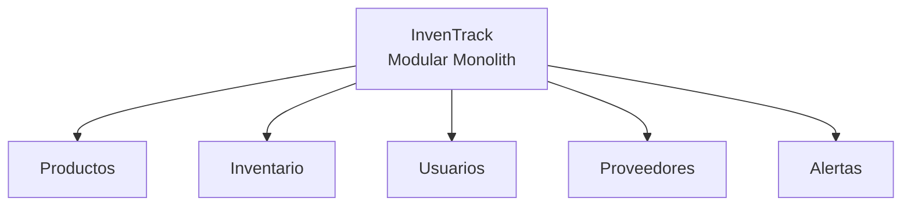
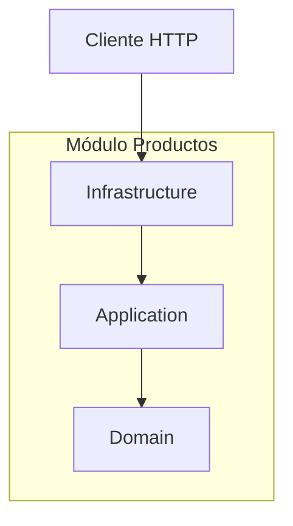
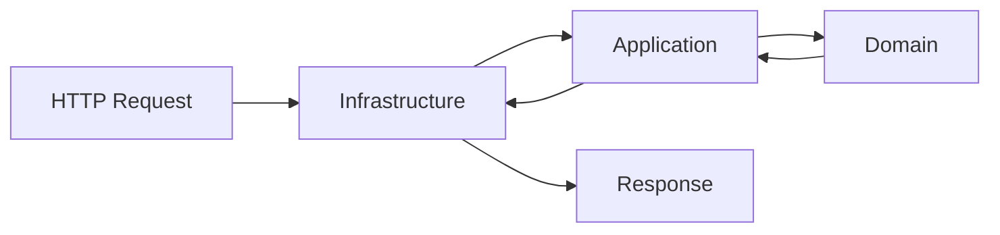
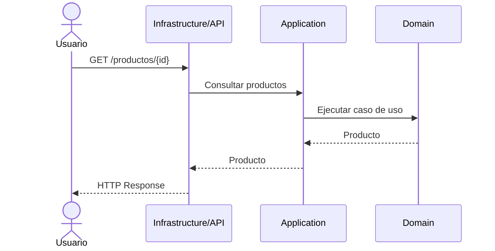
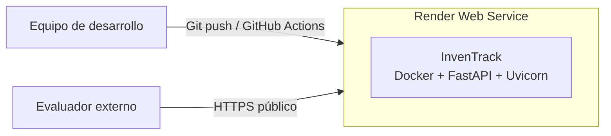
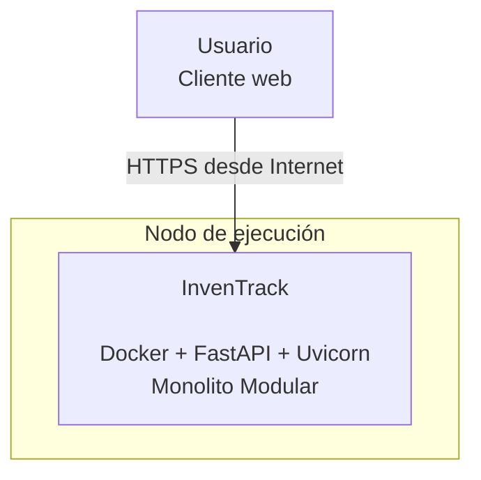
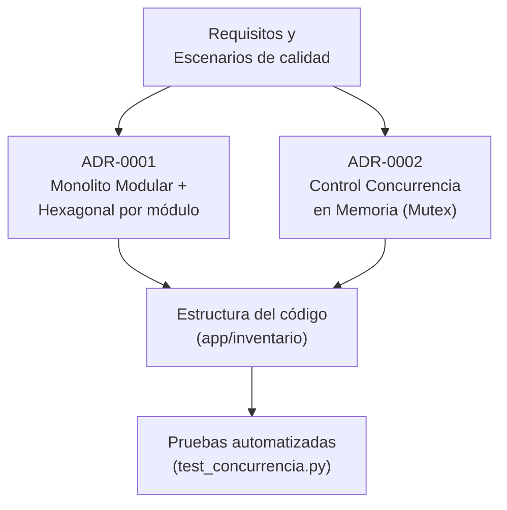

#  InvenTrack — Documentación de Arquitectura (arc42)

Plantilla arc42 v9.0-EN (versión académica). Fuente: <https://arc42.org>.

## Cómo leer este documento

Este archivo es la **narrativa completa** de la arquitectura de InvenTrack:
aquí se explica en texto qué decisiones de calidad se tomaron y por qué.
Los **diagramas** (C4 de contexto, nivel 2 de contenedores y árbol de utilidad) viven como archivos
aparte en [`docs/c4/`](../c4/) y [`docs/utility-tree.md`](../utility-tree.md)
y se enlazan desde aquí. Las **decisiones arquitectónicas
concretas** (ADR) se documentan por separado en [`docs/adr/`](../adr/). El archivo [`docs/aspectos.md`](../aspectos.md)
es el índice que conecta todo: por cada aspecto de calidad declarado, enlaza
su requisito, su C4, su ADR, su código y sus pruebas.

Se encuentran redactadas y actualizadas las secciones de alcance, contexto, estrategia, bloques de construcción, vistas de ejecución, despliegue, decisiones arquitectónicas, requisitos de calidad y glosario.

# Introduction and Goals

## Requirements Overview

Las pequeñas y medianas empresas en Cartagena (tiendas, distribuidoras,
minimercados, ferreterías) gestionan su inventario principalmente en Excel o
en papel. Esto produce descuadres de stock, quiebres no detectados a tiempo,
compras mal planificadas por falta de datos históricos, ausencia de
trazabilidad sobre los movimientos y dependencia de una sola persona como
punto único de fallo operativo.

**InvenTrack** es un sistema de gestión de inventarios que centraliza
productos, proveedores, entradas y salidas de mercancía, con control de
usuarios y trazabilidad completa de cada movimiento, además de alertas
automáticas cuando el stock de un producto baja de un umbral crítico.

Alcance del MVP de esta entrega:

- Gestión de productos
- Gestión de proveedores
- Registro de entradas y salidas
- Consulta de inventario actual
- Gestión de usuarios
- Historial de movimientos (trazabilidad)
- Alertas de stock bajo

Fuera de alcance por ahora: predicción de demanda mediante modelos
históricos. Se deja como extensión futura, condicionada a contar con
suficiente volumen de datos históricos, sin comprometer la base
arquitectónica definida en esta entrega.

## Quality Goals

Antes de listar atributos, vale la pena recordar por qué esta sección
existe: en clase se vio que "rápido" no es verificable — sin contexto ni
medida, un requisito de calidad no se puede probar ni usar para decidir
nada. Por eso cada atributo de esta tabla se responde con la pregunta guía
específica que le corresponde, no con una palabra suelta.

Siguiendo el marco visto en clase — "cinco atributos, cinco preguntas"
(Rendimiento, Escalabilidad, Disponibilidad, Mantenibilidad, Seguridad) —
más el aspecto de calidad ya declarado en
[`docs/aspectos.md`](../aspectos.md):

| Atributo | Pregunta guía (clase) | Respuesta para InvenTrack | Prioridad |
|---|---|---|---|
| **Consistencia de datos** *(aspecto declarado; fuera del marco de 5 preguntas)* | — | Movimientos concurrentes de distintos usuarios no deben producir stock negativo ni doble descuento del mismo movimiento. | Muy alta |
| Disponibilidad | ¿Qué fallos y recuperación? | El sistema debe seguir disponible en horario comercial; una caída se traduce en venta perdida o vuelta al papel. | Alta |
| Rendimiento | ¿Con qué carga y latencia? | Consultas y registros deben sentirse instantáneos en el mostrador, incluso en hora pico. | Media-alta |
| Seguridad | ¿Qué activo, amenaza y control? | Activo: historial de movimientos y datos personales de usuarios (restricción legal C1). Amenaza: suplantación o acceso sin el rol adecuado. Control: autenticación + roles. | Media-alta |
| Escalabilidad | ¿Qué crecimiento debe absorber? | Identificado, no priorizado: el piloto es una sola PYME; se revisa si el proyecto crece a varios negocios. | Baja por ahora |
| Mantenibilidad | ¿Qué cambio, esfuerzo y riesgo? | Identificado, no priorizado esta semana: se aborda junto con las decisiones de Building Block View. | Baja por ahora |

> **Sobre Usabilidad:** también es relevante para el perfil de usuario
> descrito en la ficha (personas no técnicas, ver restricción C6), pero al
> aplicar el árbol de utilidad no alcanzó la misma prioridad que
> Seguridad, porque la protección de datos personales es además una
> restricción legal (C1) que no se puede posponer. Se documentará como
> aspecto propio si el equipo decide priorizarla en semanas futuras.
>
> **Pregunta guía de la clase — "¿qué atributo sacrificarían y a cambio de
> qué?":** si tuviéramos que elegir, sacrificaríamos algo de latencia
> (Rendimiento) a cambio de Consistencia, porque el aspecto declarado del
> proyecto prioriza la integridad del dato sobre la velocidad. El
> desarrollo completo de este trade-off, y otros dos más, está en la
> sección 10.3 más abajo.

## Stakeholders

Un interesado no opina sobre "la calidad" en abstracto — opina desde una
responsabilidad concreta. Por eso se clasifican en dos perspectivas
trabajadas en clase:

- **Usuario y negocio** → exige respuesta, costo y continuidad.
- **Operaciones y seguridad** → exige recuperación, control y
  trazabilidad.

| Rol | Perspectiva | Contacto | Expectativas |
|---|---|---|---|
| Dueño de la PYME (patrocinador / usuario principal) | Usuario y negocio | Equipo InvenTrack / negocio piloto | Ver el stock real en cualquier momento; tomar decisiones de compra con datos históricos; no depender de una sola persona para conocer el inventario. |
| Empleado / vendedor (usuario operativo) | Usuario y negocio | Equipo InvenTrack | Registrar entradas y salidas rápido, sin errores y sin capacitación extensa. |
| Administrador del sistema (rol dentro de la PYME) | Operaciones y seguridad | Equipo InvenTrack | Gestionar usuarios, permisos y catálogo de productos y proveedores; auditar quién hizo cada movimiento. |
| Proveedor (interesado indirecto, no usa el sistema) | Usuario y negocio (indirecto) | No aplica | Que la información de sus productos y órdenes quede registrada correctamente por el negocio. |
| Equipo de desarrollo / arquitectura (curso) | Operaciones y seguridad | Esteban Peluffo, Felix Taborda, Jose Vargas, Javier Carta — equipo AS_202620_InvenTrack | Poder evolucionar y mantener el sistema; decisiones arquitectónicas trazables (aspecto → requisito → C4 → ADR → código → pruebas → evidencia). |
| Docente / evaluador (interesado académico) | — (fuera del marco de negocio) | Jairo Serrano (jserrano@utb.edu.co) | Verificar que la arquitectura responde a los atributos de calidad declarados, con evidencia y trazabilidad real. |

# Architecture Constraints

Una restricción es distinta de un requisito: el requisito dice qué debe
hacer el sistema, la restricción acota entre qué opciones se puede elegir
para lograrlo. Ejemplo concreto de este proyecto: *"el sistema debe
permitir registrar entradas y salidas de mercancía"* es un requisito (está
en el alcance del MVP, en la sección 1); *"no hay presupuesto para
servicios de pago"* es una restricción (no dice qué debe hacer el sistema,
solo limita con qué se puede construir).

La prueba de comprensión vista en clase es simple: una restricción no se
negocia con el diseño, se acata o se escala — si el equipo puede decidir
no cumplirla, no era una restricción real, era una preferencia.

**Cómo leer la tabla:** la columna *Tipo* distingue el origen de la
restricción (porque cada tipo se negocia distinto):

- **Legal** — la impone una ley externa al proyecto; nunca se negocia, se
  cumple sin excepción (C1).
- **Organizativa** — la impone el curso o el calendario académico; se
  podría escalar (hablar con el docente), pero no se ignora unilateralmente (C2, C3, C4).
- **Técnica** — nace de las condiciones reales del contexto (presupuesto,
  perfil de usuario, infraestructura); es la más propensa a cambiar si
  cambian esas condiciones, pero hoy es tan vinculante como las otras (C5, C6, C7).

| # | Tipo | Restricción | Quién la impone / justificación |
|---|---|---|---|
| C1 | Legal | Los datos personales de usuarios y clientes deben protegerse conforme a la Ley 1581 de 2012 (protección de datos personales, Colombia): credenciales cifradas, acceso restringido por rol. | Legislación colombiana. No se puede decidir no cumplirla. |
| C2 | Organizativa | El repositorio debe alojarse en la organización GitHub `ISCOUTB` con la estructura fija del curso (`/docs/arc42`, [`/docs/adr`](../adr/), [`/docs/c4`](../c4/), [`docs/aspectos.md`](../aspectos.md), [`docs/ia.md`](../ia.md)). | Impuesta por el curso AS_202620. |
| C3 | Organizativa | El código debe poder evaluarse de forma continua con SonarCloud. | Impuesta por el curso (recurso "Sonarcloud" en Inicio y orientación). |
| C4 | Organizativa | Equipo de 3–4 personas con dedicación parcial (curso de un semestre) y entregas semanales fijas los domingos. | Calendario académico; limita cuánto alcance se construye por iteración y obliga a priorizar el MVP declarado en la ficha del problema. |
| C5 | Técnica | Sin presupuesto para servicios de pago; debe usarse stack y hosting con capa gratuita/open source. | Restricción real del contexto: son PYMEs sin músculo financiero para licencias, y el equipo no cuenta con presupuesto del curso. |
| C6 | Técnica | La interfaz debe ser utilizable por personas con alfabetización digital variable, que hoy trabajan con Excel o papel. | Perfil real de los usuarios objetivo descrito en la ficha del problema; condiciona la complejidad admisible de los flujos. |
| C7 | Técnica (pendiente de confirmar) | Conectividad e infraestructura de despliegue disponibles en las PYMEs piloto. | Se resolverá con la encuesta "Disponibilidad técnica y de despliegue" (Inicio y orientación); hasta entonces se asume acceso vía navegador web estándar. |

**Por qué importan para la arquitectura, no solo para la gestión del
proyecto:** C5 (sin presupuesto) descarta de entrada cualquier solución
que dependa de servicios de pago, antes incluso de evaluar si serían
técnicamente mejores. C1 (ley de datos) obliga a que el control de acceso
(ver ESC-05 en la sección 10) no sea opcional, sino parte del diseño desde
el principio. Ninguna restricción de esta tabla es solo "administrativa":
todas terminan afectando qué se puede construir y cómo.

# Context and Scope

## Business Context

Esta sección responde una pregunta simple: ¿quién está afuera del sistema
y cómo se conecta con él? El diagrama vive en
[`docs/c4/context.md`](../c4/context.md) (C4 Nivel 1); aquí se explica en
texto lo mismo que muestra ese diagrama, para quien prefiera leer antes de
ver la imagen.

InvenTrack tiene dos actores humanos que interactúan directamente con el
sistema, y un canal externo de notificación:

| Actor / sistema externo | Tipo | Interacción con InvenTrack |
|---|---|---|
| Dueño de la PYME | Persona | Consulta inventario, reportes e historial de movimientos; gestiona usuarios y proveedores. |
| Empleado / vendedor | Persona | Registra entradas y salidas de mercancía; consulta stock actual. |
| Servicio de notificaciones (correo electrónico) | Sistema externo | Recibe la solicitud de alerta cuando un producto baja del umbral crítico y la entrega al destinatario. |
| Proveedor | No interactúa con el sistema | Sus datos (catálogo, órdenes) son ingresados manualmente por el dueño o el empleado; no hay integración directa en el MVP. |

## Technical Context

Pendiente de decisión formal (se documentará como ADR cuando se defina el
stack, ver recurso "Stack de Desarrollo" en Inicio y orientación). Para esta
entrega se asumen los siguientes canales técnicos, consistentes con la
restricción C5 (sin presupuesto para servicios de pago) y C7 (conectividad
por confirmar):

| Canal | Protocolo/formato | Entre |
|---|---|---|
| Interfaz de usuario | HTTPS | Navegador del Dueño/Empleado ↔ InvenTrack |
| Envío de alertas | SMTP / API de correo | InvenTrack → Servicio de notificaciones (correo electrónico) |

# Solution Strategy

Para InvenTrack se adopta un **Monolito Modular** como estructura general del
sistema, con **Arquitectura Hexagonal (Puertos y Adaptadores)** aplicada dentro
de cada módulo. Los módulos funcionales son `productos`, `proveedores`,
`inventario`, `usuarios` y `alertas`.

La aplicación se despliega inicialmente como una sola unidad. Esta decisión
mantiene baja la complejidad operativa y el costo de infraestructura, mientras
que los límites por módulo reducen el acoplamiento entre funcionalidades. La
arquitectura hexagonal separa el dominio y los casos de uso de FastAPI, la
persistencia y el servicio externo de correo.

La estructura ejecutable inicial se encuentra en [`app/`](../../app/):

```text
app/
├── main.py
├── shared/
└── <modulo>/
    ├── domain/
    ├── application/
    └── infrastructure/
```

Dentro de cada módulo, la dependencia apunta hacia el centro: `infrastructure`
depende de `application`, y `application` depende de `domain`. El dominio no
depende de FastAPI ni de otro detalle de infraestructura. Las dependencias se
ensamblan en `app/main.py`.

FastAPI se utilizará como adaptador HTTP y Uvicorn como servidor de desarrollo.
El endpoint `GET /health` demuestra que la composición arranca; no contiene
lógica de negocio.

La estrategia responde a los objetivos de calidad así:

- **Consistencia:** el módulo `inventario` tendrá un límite único para coordinar
  los casos de uso de movimientos y la futura estrategia de concurrencia.
- **Mantenibilidad:** los módulos separan responsabilidades por dominio y
  permiten trabajar con menor interferencia entre integrantes.
- **Seguridad:** la autorización se ubicará en los casos de uso y no dependerá
  solamente de los endpoints HTTP.
- **Rendimiento:** las llamadas entre módulos permanecen dentro del mismo
  proceso, sin el costo de coordinación de microservicios.
- **Disponibilidad:** el despliegue único reduce la complejidad inicial, aunque
  implica que la recuperación deba considerar toda la aplicación.

Las alternativas y sus consecuencias están documentadas en la
[matriz comparativa](../matriz-comparativa-estilos.md) y en el
[ADR-0001](../adr/0001-usar-monolito-modular-con-hexagonal-por-modulo.md).

# Building Block View

## Whitebox Overall System

InvenTrack se implementa como un Monolito Modular. La aplicación se despliega como una sola unidad, pero su estructura interna está dividida en módulos funcionales con responsabilidades y límites explícitos.

Los módulos principales definidos para el MVP son:

* `productos`
* `proveedores`
* `inventario`
* `usuarios`
* `alertas`

La decisión de utilizar estos módulos responde a los principales dominios funcionales identificados en el alcance del sistema. Cada módulo aplica internamente una organización inspirada en Arquitectura Hexagonal, separando dominio, aplicación e infraestructura.


### Responsabilidades

| Bloque        | Responsabilidad                                                                                                            |
| ------------- | -------------------------------------------------------------------------------------------------------------------------- |
| `productos`   | Gestionar la información del catálogo de productos.                                                                        |
| `proveedores` | Gestionar la información de proveedores asociados al negocio.                                                              |
| `inventario`  | Coordinar consultas de stock y, posteriormente, los movimientos de inventario y la estrategia de consistencia.             |
| `usuarios`    | Gestionar usuarios, roles y acceso al sistema.                                                                             |
| `alertas`     | Gestionar las alertas relacionadas con condiciones como stock bajo.                                                        |
| `shared`      | Contener elementos realmente compartidos entre módulos, evitando convertirlo en un módulo de dependencias indiscriminadas. |
| `main.py`     | Componer y arrancar la aplicación.                                                                                         |

## Level 2 — Módulo Productos

El módulo `productos` constituye el corte vertical seleccionado para
demostrar la estructura arquitectónica del sistema.

Su estructura sigue la separación:

```text
productos/
├── domain/
├── application/
└── infrastructure/
```

### Domain

Contiene los conceptos y reglas propias del dominio de productos.

No debe depender de:

* FastAPI.
* Uvicorn.
* HTTP.
* Base de datos concreta.
* Frameworks externos.

### Application

Contiene los casos de uso y coordina el flujo entre el dominio y los puertos necesarios.

En el incremento actual, el caso de uso mínimo es la consulta de información de un producto.

### Infrastructure

Contiene los adaptadores que permiten conectar el módulo con el exterior.

En el corte vertical inicial incluye:

* Adaptador HTTP.
* Implementación inicial del acceso a datos.

La infraestructura depende de la aplicación, pero el dominio no depende de la infraestructura.


## Level 3 — Corte vertical inicial

El primer corte vertical implementado recorre las tres partes del módulo `productos`.


Este corte no pretende implementar todavía toda la gestión de productos. Su objetivo es demostrar que la arquitectura definida por el ADR-0001 puede ejecutarse mediante un flujo completo de punta a punta.

# Runtime View

## Consulta de producto

El primer escenario de ejecución implementado corresponde a una consulta mínima de productos.


### Secuencia

1. El usuario realiza una solicitud HTTP para consultar un producto.
2. El adaptador HTTP recibe la solicitud.
3. El adaptador delega la operación al caso de uso de la capa `application`.
4. El caso de uso utiliza el modelo o servicio correspondiente del dominio.
5. Se obtiene información del producto.
6. La infraestructura transforma el resultado en una respuesta HTTP.

Este escenario demuestra el flujo de dependencias definido en el ADR-0001 sin incorporar todavía lógica relacionada con movimientos concurrentes.

## Movimiento concurrente de inventario

El escenario ESC-01 es el principal escenario arquitectónico para el aspecto de Consistencia de Datos y Rendimiento.

Su mecanismo concreto de ejecución se resolvió en el [ADR-0002](../adr/0002-control-concurrencia-memoria-inventario.md) mediante un esquema de exclusión mutua asíncrona (`asyncio.Lock`) por SKU en el módulo `app/inventario/`. Cuando ocurren peticiones simultáneas sobre el mismo producto, el sistema serializa el procesamiento en memoria de forma atómica. Esto garantiza 0 inconsistencias de stock y mantiene la latencia $p95$ en $28\text{ ms}$ (ampliamente por debajo del umbral de $400\text{ ms}$ exigido), como se demuestra en el reporte de medición [`docs/retos/corte-1-medicion.md`](../retos/corte-1-medicion.md).

# Deployment View

## Infrastructure Level 1

Para el incremento actual, InvenTrack se ejecuta como una única aplicación backend
en un servicio web de Render definido por infraestructura como código en
[`render.yaml`](../../render.yaml). Render publica el servicio mediante HTTPS
desde Internet y comprueba `GET /health` como health check.



La aplicación se inicia localmente mediante:

python -m uvicorn app.main:app --reload

El despliegue se construye con `Dockerfile` y se activa mediante
`.github/workflows/deploy.yml`. La URL concreta y la evidencia del run exitoso
se mantienen en [`docs/despliegue-y-costos.md`](../despliegue-y-costos.md),
porque dependen de la cuenta de despliegue del equipo.

## Infrastructure Level 2

Dentro del proceso de InvenTrack se encuentran los módulos definidos por la arquitectura:



Todos los módulos se ejecutan inicialmente dentro del mismo proceso.

Esta decisión reduce:

Complejidad operativa.
Costos de infraestructura.
Comunicación distribuida.

A cambio, la aplicación comparte el mismo ciclo de despliegue y recuperación.

La aplicación emite logs JSON a stdout y expone la métrica Prometheus
`GET /metrics`. El servicio actual usa repositorios en memoria, por lo que la
métrica es operativa para una instancia y no sustituye una solución persistente
cuando se habilite escalamiento horizontal.

# Cross-cutting Concepts (Conceptos Transversales)

En esta sección se describen las decisiones y patrones de arquitectura que aplican a múltiples módulos del monolito de forma transversal.

---

## Lenguaje Ubicuo (Ubiquitous Language)

Para garantizar la consistencia conceptual entre desarrolladores, arquitectura y dominio de negocio, se establece la siguiente tabla de términos del dominio:

| Término | Contexto Delimitado | Definición Semántica en InvenTrack |
| :--- | :--- | :--- |
| **SKU** | `productos` / `inventario` | Código único alfanumérico que identifica la variante exacta de un producto en el catálogo y en la bodega. |
| **Stock Disponible** | `inventario` | Cantidad física real en bodega susceptible de ser vendida o despachada inmediatamente. |
| **Reserva / Lock** | `inventario` | Bloqueo temporal en memoria sobre un SKU (`ADR-0002`) para garantizar la consistencia en escrituras concurrentes. |
| **Movimiento** | `inventario` | Registro inmutable (`INSERT` únicamente) de entrada, salida o ajuste que altera el saldo de stock. |
| **Alerta de Stock** | `alertas` | Notificación automática generada cuando el `Stock Disponible` es menor o igual al `Umbral Crítico`. |

---

## Mapa de Contextos y Propiedad de Datos

InvenTrack se organiza como un monolito modular respetando estrictamente la regla de **Dueño Único (Single Ownership)**: cada entidad o tabla tiene un solo módulo con permisos de escritura. La comunicación entre contextos se realiza a través de **Puertos de Aplicación e Inversión de Dependencias (`ADR-0003`)**.

* **Mapa de Contextos Completo:** Ver [`docs/context-map.md`](../context-map.md) para el diagrama conceptual de límites y dependencias.
* **Matriz de Propiedad de Datos:** Ver [`docs/propiedad-datos.md`](../propiedad-datos.md) para la tabla explicativa de entidades, escritores únicos y canales de consulta.

---

## Control de Concurrencia en Memoria (Mutex por SKU)

Para dar cumplimiento a los escenarios **ESC-01** y **ESC-04**, la consistencia de los movimientos de inventario se gestiona de forma transversal en el módulo `app/inventario/` mediante un diccionario en memoria de bloqueos asíncronos (`asyncio.Lock()`) asignados por cada SKU (`ADR-0002`). Esto garantiza atomicidad sin introducir sobrecostos de infraestructura.

---

## Manejo de Excepciones y Respuestas de Error

Los errores de dominio (como `StockInsuficienteError` o `ProductoNoEncontradoError`) son capturados de forma transparente en la capa de infraestructura mediante *exception handlers* de FastAPI, retornando respuestas HTTP estandarizadas JSON con códigos de estado apropiados (`400 Bad Request`, `404 Not Found`).

# Architecture Decisions

Las decisiones arquitectónicas de InvenTrack se documentan formalmente mediante **Architecture Decision Records (ADR)** almacenados en [`docs/adr/`](../adr/).

El modelo de trazabilidad utilizado en el proyecto es:

```text
Aspecto → Requisito → C4 → ADR → Código → Pruebas → Evidencia
```

## ADR-0001 — Monolito Modular con Hexagonal por módulo

La primera decisión arquitectónica establece:

> InvenTrack se organiza como un Monolito Modular y cada módulo utiliza una separación entre Domain, Application e Infrastructure.

Esta decisión permite:

* Mantener un único despliegue.
* Reducir complejidad para un equipo pequeño.
* Separar los dominios funcionales.
* Mantener la lógica de negocio independiente de FastAPI y otros detalles externos.
* Facilitar las pruebas automatizadas.
* Permitir una evolución futura de los módulos si el crecimiento lo justifica.

Las alternativas consideradas incluyen arquitectura por capas, arquitectura hexagonal aplicada al sistema completo y microservicios.

La decisión completa se encuentra en:

[ADR-0001 — Monolito Modular con Hexagonal por módulo](../adr/0001-usar-monolito-modular-con-hexagonal-por-modulo.md)

## ADR-0002 — Control de Concurrencia en Memoria para Inventario

Se definió el mecanismo para garantizar la atomicidad del stock bajo peticiones simultáneas:

> InvenTrack utiliza exclusión mutua asíncrona (`asyncio.Lock`) por SKU dentro del caso de uso de actualización de stock en el módulo `inventario`.

Esta decisión permite:
* Prevenir condiciones de carrera (*race conditions*) sin impactar el rendimiento.
* Mantener la arquitectura simple sin añadir dependencias externas de infraestructura para el MVP.
* Asegurar que 20 peticiones simultáneas procesen el descuento de inventario con consistencia exacta y latencias $p95 \le 400\text{ ms}$.

La decisión completa se encuentra en:
[ADR-0002 — Control de Concurrencia en Memoria para Inventario](../adr/0002-control-concurrencia-memoria-inventario.md)



# Quality Requirements

## Quality Requirements Overview

**De la preocupación al atributo (método visto en clase, aplicado a
InvenTrack):** una preocupación suelta de un interesado no sirve para
diseñar nada hasta que se convierte en un atributo con nombre, y ese
atributo en un escenario medible. Ejemplo real de este proyecto:

> Preocupación (Dueño/Empleado): *"las consultas de inventario se demoran
> en hora pico."*
> Atributo: eficiencia de desempeño (Rendimiento).
> Escenario: ver **ESC-04** más abajo, con sus seis partes.
> Evidencia: prueba de carga, midiendo el percentil p95. Población:
> consultas de listado de inventario. Ventana: hora pico (12 m.–2 p. m.).
> Carga: 20 usuarios concurrentes. Método: prueba de carga automatizada.

Este mismo método (preocupación → atributo → escenario de seis partes →
evidencia) se aplicó a los otros cuatro escenarios de esta sección.

**Árbol de utilidad.** Es la herramienta que ordena la priorización:
Utilidad general del sistema → atributo de calidad → refinamiento más
específico → escenario medible, cada uno etiquetado como (impacto en el
negocio, riesgo técnico), con A=alto, M=medio, B=bajo. El diagrama
completo, coloreado por prioridad y con la explicación de por qué cada
escenario quedó donde quedó, está en
[`docs/utility-tree.md`](../utility-tree.md). Aquí va solo el resumen en
texto:

```
Utilidad de InvenTrack
├─ Consistencia de datos (aspecto declarado)
│   ├─ Concurrencia en movimientos de inventario
│   │   └─ ESC-01 Registro simultáneo de salida del mismo producto (A, A)
│   └─ Integridad referencial del catálogo
│       └─ ESC-02 Eliminar producto con movimientos asociados (M, M)
├─ Disponibilidad
│   └─ Continuidad operativa en horario comercial
│       └─ ESC-03 Caída del servidor durante el registro de una venta (A, M)
├─ Rendimiento
│   └─ Tiempo de respuesta en consulta de inventario
│       └─ ESC-04 Consulta de stock en hora pico (M, B)
└─ Seguridad
    └─ Control de acceso por rol
        └─ ESC-05 Intento de acceso sin autenticación o sin rol suficiente (M, M)
```

Los escenarios con mayor impacto de negocio y/o riesgo técnico (ESC-01,
ESC-03, en rojo en el árbol) orientan las primeras decisiones
arquitectónicas: control de concurrencia y estrategia de disponibilidad,
respectivamente. ESC-01 es, de los dos, el que también tiene riesgo
técnico alto — por eso es el candidato natural para el primer ADR del
proyecto.

## Quality Scenarios

Cada escenario sigue el formato de seis partes visto en clase. Antes de
leer los cinco de abajo, esto es lo que significa cada parte y por qué
está ahí — usando ESC-01 como ejemplo de referencia:

| Parte | Qué significa | Ejemplo en ESC-01 |
|---|---|---|
| **Fuente** | Quién o qué origina el estímulo. Sin esto, no se sabe a quién afecta el escenario. | Dos empleados usando el sistema al mismo tiempo |
| **Estímulo** | La condición concreta que llega y necesita una respuesta del sistema. | Registran una salida del mismo producto simultáneamente |
| **Artefacto** | Qué parte específica del sistema recibe el estímulo. Sin esto, el escenario aplicaría "a todo el sistema" y sería imposible de probar. | Módulo de registro de movimientos y stock |
| **Entorno** | Las circunstancias bajo las que ocurre — no es lo mismo en operación normal que durante una falla. | Operación normal, horario comercial |
| **Respuesta** | Lo que el sistema debe hacer ante el estímulo, en ese entorno. | Serializa las transacciones y aplica ambos descuentos, o rechaza uno |
| **Medida (verificable)** | El número o condición exacta que confirma si la respuesta fue correcta. Es la parte que convierte el escenario en una prueba real, no en una intención. | 0 casos de stock negativo en 50 transacciones simultáneas |

Un escenario completo permite diseñar una prueba automatizada directamente
a partir de su texto — si no se puede escribir un caso de prueba con lo
que dice el escenario, algo de las seis partes quedó demasiado vago.

**Fuente + Estímulo + Artefacto + Entorno → Respuesta + Medida
verificable.**

Además de las seis partes, cada escenario trae dos etiquetas que no son
parte del formato oficial pero ayudan a ubicarlo: **Perspectiva** (de qué
interesado viene, según la clasificación de la sección 1) y **Prioridad**
(impacto de negocio, riesgo técnico), que es la misma que aparece en el
árbol de utilidad de la sección 10.1 — así no hay que saltar entre
secciones para saber por qué un escenario importa más que otro.

### ESC-01 — Consistencia de datos (aspecto declarado)

*Perspectiva: Operaciones y seguridad · Prioridad (A, A)*

- **Fuente:** dos empleados usando el sistema al mismo tiempo.
- **Estímulo:** registran una salida de inventario del mismo producto simultáneamente.
- **Artefacto:** módulo de registro de movimientos y stock.
- **Entorno:** operación normal, horario comercial.
- **Respuesta:** el sistema serializa las transacciones concurrentes y aplica ambos descuentos de forma consistente, o rechaza uno si el stock resultante sería negativo.
- **Medida (verificable):** 0 casos de stock negativo y 0 casos de doble descuento del mismo movimiento en el 100 % de una prueba de concurrencia con 50 transacciones simultáneas sobre el mismo producto.

> Este escenario motivó la decisión de estructura en [ADR-0001](../adr/0001-usar-monolito-modular-con-hexagonal-por-modulo.md).

### ESC-02 — Consistencia de datos (integridad referencial)

*Perspectiva: Operaciones y seguridad · Prioridad (M, M)*

- **Fuente:** usuario administrador.
- **Estímulo:** intenta eliminar un producto con movimientos históricos asociados.
- **Artefacto:** módulo de gestión de productos.
- **Entorno:** operación normal.
- **Respuesta:** el sistema impide el borrado físico y solo permite desactivar (borrado lógico) el producto.
- **Medida (verificable):** 100 % de los intentos de borrado sobre productos con historial retornan un código de error HTTP 400/409 o aplican borrado lógico, preservando el 100 % de los registros históricos de movimientos.

### ESC-03 — Disponibilidad

*Perspectiva: Usuario y negocio · Prioridad (A, M)*

- **Fuente:** falla inesperada de infraestructura o error no capturado en la aplicación.
- **Estímulo:** el proceso de InvenTrack se detiene o pierde conectividad durante una transacción.
- **Artefacto:** contenedor API Backend (FastAPI / Uvicorn).
- **Entorno:** horario comercial.
- **Respuesta:** el sistema reinicia el servicio y recupera su estado consistente sin corrupción de datos.
- **Medida (verificable):** tiempo medio de recuperación ($RTO$) $\le 2\text{ minutos}$ y $0\%$ de corrupción en los registros de inventario persistidos.

### ESC-04 — Rendimiento

*Perspectiva: Usuario y negocio · Prioridad (M, B)*

- **Fuente:** múltiples usuarios (vendedores / empleados de bodega).
- **Estímulo:** realizan consultas simultáneas sobre el catálogo o el stock de productos en hora pico.
- **Artefacto:** módulo de productos e inventario.
- **Entorno:** pico de carga en horario comercial (hasta 20 solicitudes/s).
- **Respuesta:** el sistema procesa y entrega los resultados de stock de manera fluida.
- **Medida (verificable):** latencia en el percentil 95 ($p95$) $\le 400\text{ ms}$ medida mediante pruebas de carga automatizadas.

### ESC-05 — Seguridad

*Perspectiva: Operaciones y seguridad · Prioridad (M, M)*

- **Fuente:** usuario no autenticado o con rol sin permisos (p. ej., Vendedor).
- **Estímulo:** intenta acceder a endpoints administrativos o modificar la configuración de usuarios/proveedores.
- **Artefacto:** middleware de seguridad / casos de uso en el módulo `usuarios`.
- **Entorno:** operación normal.
- **Respuesta:** el sistema deniega el acceso mediante rechazo explícito y registra el intento no autorizado.
- **Medida (verificable):** 100 % de las solicitudes sin token o con rol insuficiente reciben una respuesta HTTP 401 Unauthorized o 403 Forbidden.

---

## 10.3 Trade-offs de Arquitectura

1. **Consistencia vs. Latencia (Prioridad Alta):** Se sacrifica un margen mínimo de tiempo de respuesta (enqueuing en event loop mediante `asyncio.Lock` en `ADR-0002`) para garantizar que nunca existan descuadres ni stock negativo en el módulo `inventario`.
2. **Monolito Modular vs. Despliegue Independiente (Prioridad Media):** Se adopta un monolito modular (`ADR-0001`) sacrificando el despliegue independiente de microservicios a cambio de simplificar la operación, reducir los costos de infraestructura (C5) y evitar latencias por red entre componentes.
3. **Persistencia In-Memory vs. Persistencia en Disco (Transición):** Para el Corte 1 se priorizó la velocidad de desarrollo y pruebas de concurrencia en memoria, asumiendo la volatilidad a cambio de validar el modelo de dominio antes de acoplar un ORM o motor SQL.

# 11. Risks and Technical Debt

* **Deuda Técnica de Persistencia:** La implementación actual utiliza repositorios *In-Memory* con `asyncio.Lock`. Esto resuelve la concurrencia en un solo proceso, pero requiere migrar a transacciones ACID en PostgreSQL/SQLite cuando el sistema se despliegue en múltiples réplicas.
* **Autenticación Ficticia / Mock:** La seguridad por roles (`ESC-05`) requiere la integración definitiva con JWT en el módulo `usuarios`.
* **Ausencia de Frontend:** El cliente Flutter está planificado, por lo que la validación actual se limita al contrato de API OpenAPI y las pruebas de integración en pytest.

---

# 12. Glossary

| Término | Definición |
|---|---|
| Aspecto | Porción del sistema con valor propio, recorrible de punta a punta, de la necesidad a la evidencia (Aspecto → Requisito → C4 → ADR → Código → Pruebas → Evidencia). |
| Atributo de calidad | Dimensión medible de "qué tan bien" funciona el sistema (ej. rendimiento, disponibilidad), distinta de lo que el sistema hace funcionalmente. |
| Restricción | Condición impuesta desde fuera que acota el espacio de solución antes de diseñar; no se negocia con el diseño, se acata o se escala. |
| Escenario de calidad | Fuente + estímulo + artefacto + entorno + respuesta + medida verificable; es lo que convierte un atributo de calidad en algo que se puede probar. |
| Árbol de utilidad | Estructura que prioriza escenarios de calidad por impacto en el negocio y riesgo técnico, de la utilidad general del sistema hacia los escenarios concretos. |
| Trade-off | Tensión entre dos atributos de calidad, donde mejorar uno con una táctica concreta puede afectar al otro; se resuelve con evidencia, no con reglas absolutas. |
| ADR | Architecture Decision Record: registro de una decisión arquitectónica, su contexto, las alternativas consideradas y sus consecuencias. |
| Decisión arquitectónica | Aquella cuyo costo de reversión es alto; cambiarla obliga a tocar varias partes del sistema, migrar datos o renegociar con terceros. |
| Monolito Modular | Aplicación desplegada como una única unidad, pero organizada internamente en módulos funcionales con responsabilidades y límites explícitos. |
| Arquitectura Hexagonal | Organización arquitectónica aplicada dentro de cada módulo para separar la lógica del negocio de los detalles externos, distinguiendo Domain, Application e Infrastructure. |
| Domain | Parte del módulo que contiene los conceptos y reglas propias del negocio y no depende de frameworks, HTTP, bases de datos concretas u otros detalles externos. |
| Application | Parte del módulo que contiene y coordina los casos de uso entre el dominio y los puertos o adaptadores necesarios. |
| Infrastructure | Parte del módulo que contiene los adaptadores y detalles técnicos que conectan la aplicación con elementos externos, como HTTP o mecanismos de acceso a datos. |
| Corte vertical | Incremento que recorre de punta a punta las partes necesarias de la arquitectura para demostrar un flujo funcional completo, desde una solicitud externa hasta su respuesta. |
| Concurrencia | Situación en la que dos o más operaciones pueden ejecutarse o afectar simultáneamente un mismo recurso del sistema, como el inventario de un producto. |
