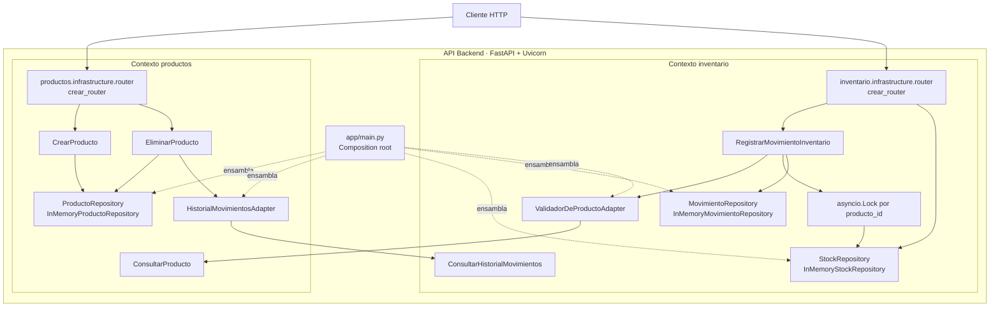

# C4 Nivel 3: Diagrama de Componentes — API Backend InvenTrack

Este nivel abre el contenedor `API Backend` del [C4 Nivel 2](containers.md) y
muestra los componentes implementados actualmente. Los módulos `proveedores`,
`usuarios` y `alertas` todavía no tienen componentes de código.

## Correspondencia con el código

| Componente | Implementación actual |
|---|---|
| Router de productos | `app/productos/infrastructure/router.py` |
| Casos de uso de productos | `CrearProducto`, `ConsultarProducto`, `EliminarProducto` |
| Repositorio de productos | `InMemoryProductoRepository` |
| Router de inventario | `app/inventario/infrastructure/router.py` |
| Registro de movimientos | `RegistrarMovimientoInventario` |
| Consulta de historial | `ConsultarHistorialMovimientos` |
| Repositorios de inventario | `InMemoryStockRepository`, `InMemoryMovimientoRepository` |
| Integración entre contextos | `HistorialMovimientosAdapter`, `ValidadorDeProductoAdapter` |
| Composición | `app/main.py` |

## Reglas de dependencia

- Los routers reciben sus dependencias desde `app/main.py`.
- Los casos de uso dependen de puertos y dominio, no de FastAPI.
- `HistorialMovimientosAdapter` consume `ConsultarHistorialMovimientos`.
- `ValidadorDeProductoAdapter` consume `ConsultarProducto`.
- `asyncio.Lock` se crea dentro de `RegistrarMovimientoInventario` y se
  mantiene por `producto_id` para serializar movimientos del mismo producto.
- La persistencia actual es in-memory. PostgreSQL o SQLite son alternativas
  futuras que deberán implementarse como adaptadores detrás de los puertos.

## Alcance actual y objetivo

El diagrama representa el estado implementado del backend. La persistencia
relacional, el frontend Flutter, las alertas, los usuarios y los proveedores
pertenecen a la arquitectura objetivo y no se presentan como componentes
existentes.
