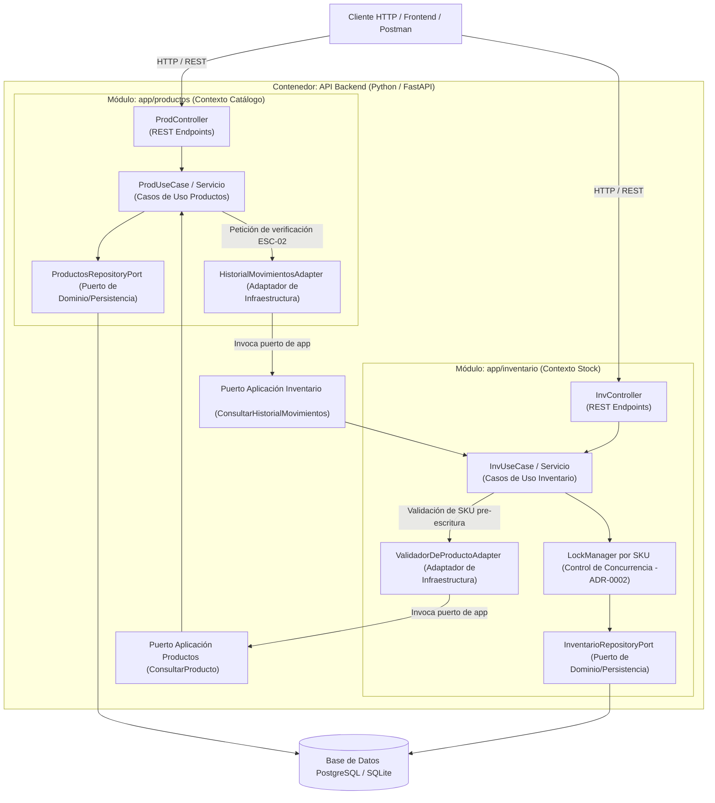

# C4 Nivel 3: Diagrama de Componentes — API Backend InvenTrack

**Propósito:** Descomponer la arquitectura interna del contenedor **API Backend (FastAPI)**, mostrando cómo interactúan las capas de los módulos `productos` e `inventario` mediante **Puertos y Adaptadores (Arquitectura Hexagonal)** y el desacoplamiento definido en el **ADR-0003**[cite: 1, 2].

---

## Diagrama de Componentes 

    ## Descripción Técnica de Componentes

### **Módulo `productos` (`app/productos/`)**
* **`ProdController`:** Expone los endpoints HTTP (`/productos`) para la gestión del catálogo.
* **`ProdUseCase`:** Aplica la lógica de negocio (creación, edición, eliminación lógica) y valida reglas de dominio.
* **`HistorialMovimientosAdapter`:** Implementación en infraestructura que consulta el puerto expuesto por `inventario` para verificar si un producto tiene transacciones registradas antes de ser borrado (`ESC-02`)[cite: 2].

### **Módulo `inventario` (`app/inventario/`)**
* **`InvController`:** Expone los endpoints HTTP (`/inventario/movimientos`, `/inventario/stock`) para operaciones de almacén.
* **`InvUseCase`:** Procesa entradas, salidas y ajustes de stock.
* **`LockManager`:** Implementa exclusión mutua (`asyncio.Lock`) por SKU para prevenir condiciones de carrera ante llamadas simultáneas (`ADR-0002`).
* **`ValidadorDeProductoAdapter`:** Implementación en infraestructura que invoca el puerto expuesto por `productos` para garantizar que no se registren movimientos sobre SKUs inactivos o inexistentes (`ADR-0003`)[cite: 2].