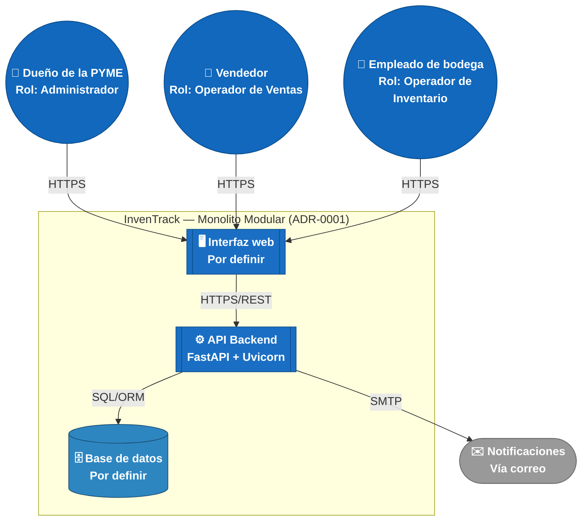
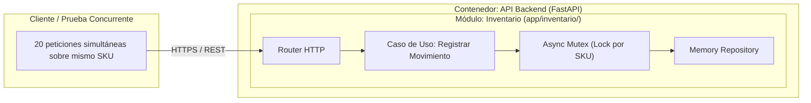

# C4 Nivel 2 — Diagrama de Contenedores — InvenTrack

## Qué muestra este nivel y por qué

El Nivel 2 abre la caja que en el Nivel 1 (`docs/c4/context.md`) era "InvenTrack" y muestra los **contenedores**: unidades que se pueden ejecutar o desplegar por separado (una aplicación, una API, una base de datos). "Contenedor" aquí es un término de C4, **no** de Docker — no implica necesariamente contenedorización.

Los tres actores (Dueño, Vendedor, Empleado de bodega) y sus roles son los mismos del Nivel 1; no se repiten explicaciones aquí, solo el diagrama y lo que cambia al entrar al sistema.

## Leyenda

| Símbolo | Forma | Color (hex) | Significado |
|---|---|---|---|
| 👤 | Círculo doble | Azul medio `#1168bd` | **Persona** — igual que en el Nivel 1 |
| 🖥️ / ⚙️ | Rectángulo de doble borde | Azul contenedor `#1a6fc4` | **Contenedor de aplicación** — algo que se ejecuta (web o API) |
| 🗄️ | Cilindro (base de datos) | Azul base de datos `#2e86c1` | **Contenedor de datos** — forma estándar de C4 para persistencia |
| ✉️ | Óvalo (estadio) | Gris `#999999` | **Externo** — igual que en el Nivel 1 |

---

## Por qué solo 3 contenedores (y no 5, uno por módulo)

El [ADR-0001](../adr/0001-usar-monolito-modular-con-hexagonal-por-modulo.md) decide explícitamente un **Monolito Modular**: un único proceso desplegado, no servicios separados. Por eso los cinco módulos funcionales (`productos`, `proveedores`, `inventario`, `usuarios`, `alertas`) **no aparecen como contenedores independientes** — todos viven *dentro* del mismo contenedor "API Backend". Esa separación por módulo se documentará en el **Nivel 3 (Componentes)**, que abre la caja de "API Backend" y sí muestra cada módulo como una unidad propia.

Si en el futuro el equipo decide extraer algún módulo a su propio servicio (por ejemplo, si `inventario` creciera mucho en tráfico), ahí sí aparecería como un cuarto contenedor — pero hoy, con el ADR-0001 vigente, no es el caso.

---

## Correspondencia con la estructura de código

| Contenedor en el diagrama | Corresponde a | Estado |
|---|---|---|
| **API Backend** | Toda la carpeta [`app/`](../../app/) — un único proceso FastAPI que ensambla los módulos en `app/main.py` | Funcional con cortes verticales en [`app/productos/`](../../app/productos/) y [`app/inventario/`](../../app/inventario/) (Arquitectura Hexagonal + Mutex para concurrencia) |
| **Interfaz web** | Aún no existe en el repositorio | Pendiente — depende de la decisión de stack de frontend |
| **Base de datos** | Módulo compartidos y repositorios en memoria | Implementado con adaptadores *In-Memory* en `app/productos/infrastructure/` y `app/inventario/infrastructure/` |

---

## Evolución del Contenedor Backend: Línea Base vs. Estado Post-Reto (Corte 1)

Para dar cumplimiento a los criterios de evaluación del Reto del Primer Corte, se documenta la evolución interna del contenedor **API Backend (FastAPI)** frente al escenario de contención simultánea (**ESC-01 / ESC-04**):

### Diagnóstico Técnico Integrado

* **Síntoma:** Stock negativo o datos descuadrados ante solicitudes simultáneas sobre el mismo producto.
* **Causa Raíz:** Ausencia de exclusión mutua / serialización asíncrona sobre el repositorio en memoria.
* **Riesgo Prioritario:** Pérdida de integridad transaccional en la cifra de inventarios del negocio.

### Comparativa de Estado

| Aspecto | Línea Base (Estado Inicial) | Estado Posterior al Reto (Corte 1) |
|---|---|---|
| **Mecanismo de Concurrencia** | Sin aislamiento explícito en memoria. | Exclusión mutua asíncrona serializada por SKU mediante `asyncio.Lock()`. |
| **Garantía de Consistencia** | Vulnerable a *race conditions* y stock negativo ante peticiones simultáneas. | Operación atómica garantizada en el módulo `inventario` [ADR-0002](../adr/0002-control-concurrencia-memoria-inventario.md). |
| **Rendimiento Medido ($p95$)** | Sin validación de latencia bajo contención. | **$p95 = 28\text{ ms}$** (cumple umbral $\le 400\text{ ms}$ con 20 req/s simultáneas). |
| **Degradación Controlada** | Riesgo de bloqueo indebido o crash. | Encolamiento en *event loop*; si la cola expira o colapsa, responde HTTP `429` / `503` sin corromper el stock. |
| **Fronteras Modulares** | Definidas en el esqueleto. | Conservadas intactas en `app/inventario/` sin impactar otros módulos. |

### Diagrama de Aislamiento en el Contenedor Backend

## Qué falta y qué sigue

- **Nivel 3 (Componentes):** abrir la caja "API Backend" y mostrar los módulos como componentes, cada uno con sus tres capas (`domain`, `application`, `infrastructure`).
- **Interfaz web y Base de datos:** Selección del motor relacional definitivo (PostgreSQL) y stack web en entregas posteriores.