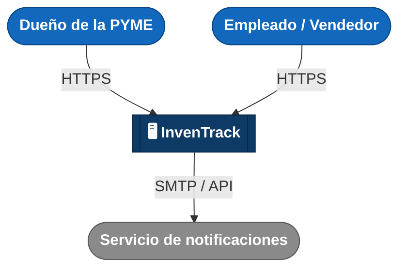

# C4 Nivel 1 — Diagrama de Contexto — InvenTrack

Vista más alta de C4: el sistema como una caja única, quién lo usa y con
qué otro sistema se conecta. Sin componentes internos todavía.

Azul claro = persona · Azul oscuro = InvenTrack (este sistema) · Gris = sistema externo

## Detalle de cada actor y sistema

| Actor / sistema | Tipo | Qué hace / para qué se conecta |
|---|---|---|
| Dueño de la PYME | Persona | Consulta inventario, reportes e historial de movimientos; gestiona usuarios y proveedores. |
| Empleado / vendedor | Persona | Registra entradas y salidas de mercancía; consulta stock actual. |
| InvenTrack | Sistema (este proyecto) | Centraliza productos, proveedores, movimientos de inventario, usuarios y alertas de stock bajo. |
| Servicio de notificaciones | Sistema externo | Recibe la solicitud de alerta cuando un producto baja del umbral crítico y la entrega por correo electrónico al destinatario. |

**Nota:** el Proveedor es un interesado indirecto — sus datos (catálogo,
órdenes) los ingresan manualmente el Dueño o el Empleado dentro de
InvenTrack. No hay integración directa con sistemas de proveedores en el
MVP, por lo que no aparece como actor externo en este diagrama.
