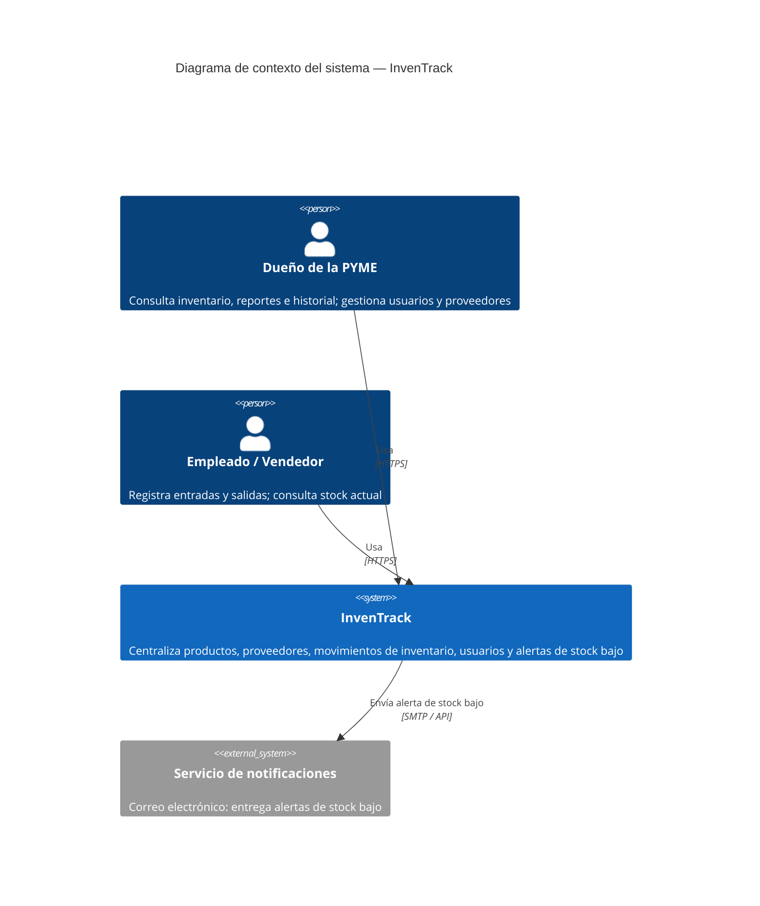

# C4 Nivel 1 — Diagrama de Contexto — InvenTrack

**Nota:** el Proveedor es un interesado indirecto: sus datos (catálogo,
órdenes) los ingresan manualmente el Dueño o el Empleado dentro de
InvenTrack; no hay integración directa con sistemas de proveedores en el
MVP, por lo que no aparece como actor externo en este diagrama de contexto.
