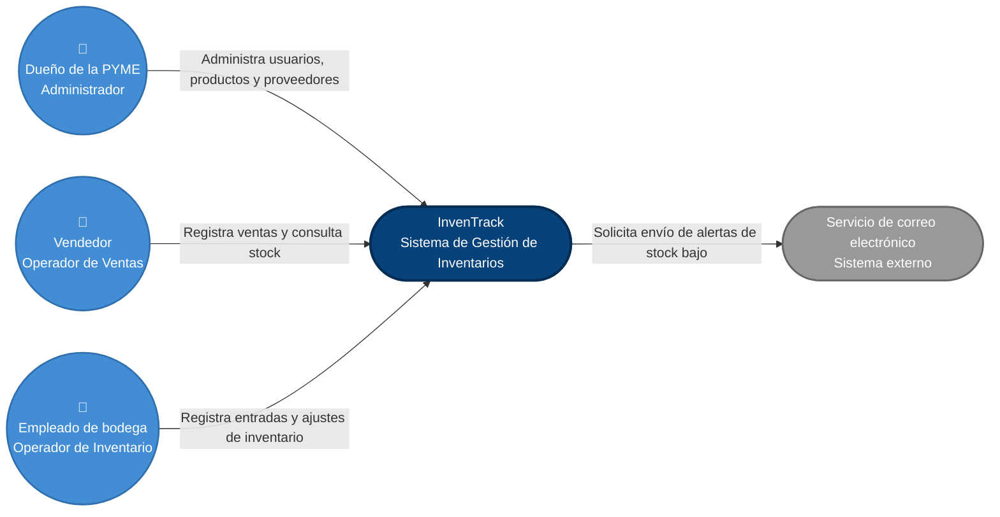

# C4 Nivel 1 — Diagrama de Contexto — InvenTrack

## 1. Propósito del diagrama

Este documento presenta el **C4 Nivel 1 — Diagrama de Contexto** de
**InvenTrack**, el sistema de gestión de inventarios para pequeñas y medianas
empresas.

El objetivo de este nivel es mostrar a InvenTrack como una única caja lógica y
explicar:

- quiénes utilizan el sistema;
- qué rol cumple cada persona;
- qué responsabilidad tiene cada actor;
- qué sistema externo utiliza InvenTrack;
- qué información o acción intercambia cada actor con InvenTrack;
- qué elementos pertenecen al alcance del proyecto y cuáles son externos.

En C4, el diagrama de contexto representa el sistema que se está construyendo
rodeado por las personas y sistemas de software con los que interactúa
directamente. No se muestran todavía los módulos internos, clases, bases de
datos
ni componentes de InvenTrack, porque esos detalles corresponden a niveles
posteriores de zoom.

Por esta razón, **InvenTrack aparece como una única unidad** en este nivel.

---

## 2. Diagrama



---

## 3. Leyenda del diagrama

La representación visual diferencia los tres tipos principales de elementos
utilizados en este nivel.

| Elemento visual | Tipo C4 | Significado |
|---|---|---|
| 👤 Círculo azul | **Person** | Persona o actor humano que interactúa directamente con InvenTrack |
| Forma azul oscuro | **Software System** | Sistema que se encuentra dentro del alcance del proyecto |
| Forma gris | **External Software System** | Sistema externo que InvenTrack utiliza pero que no forma parte del proyecto |
| Flecha | **Relationship** | Relación o interacción entre dos elementos |
| Texto sobre la flecha | **Descripción de relación** | Explica qué acción o información se intercambia |

### Convención de colores

- **Azul medio:** personas que utilizan InvenTrack.
- **Azul oscuro:** InvenTrack, sistema principal dentro del alcance.
- **Gris:** sistema externo fuera del alcance del proyecto.

El color no se utiliza como único indicador del significado: el tipo también
se comunica mediante la forma, el símbolo de persona y la descripción textual.
Esto permite que la interpretación del diagrama no dependa únicamente del
color.

---

## 4. Elementos del contexto

### 4.1 Dueño de la PYME

**Tipo:** Person  
**Rol:** Administrador

El dueño de la pequeña o mediana empresa es el responsable administrativo
principal de InvenTrack.

Sus responsabilidades dentro del sistema son:

- gestionar usuarios;
- administrar el catálogo de productos;
- gestionar proveedores;
- consultar el inventario;
- consultar el historial de movimientos;
- revisar información relacionada con las operaciones del negocio;
- supervisar las alertas de stock bajo.

Se representa como una **Person** porque es un actor humano que interactúa
directamente con el sistema.

El rol **Administrador** también permite relacionarlo con el escenario
**ESC-05 — Control de acceso por rol**, donde se requiere distinguir los
permisos de los diferentes tipos de usuario.

---

### 4.2 Vendedor

**Tipo:** Person  
**Rol:** Operador de Ventas

El vendedor utiliza InvenTrack principalmente durante el proceso de venta.

Sus responsabilidades son:

- consultar la disponibilidad de productos;
- registrar salidas de inventario asociadas a ventas;
- consultar el stock actual;
- generar movimientos que deben quedar registrados en el historial.

El vendedor se separa deliberadamente del empleado de bodega porque ambos
interactúan con el inventario, pero realizan operaciones diferentes.

Esta separación también es importante para el escenario:

**ESC-01 — Registro simultáneo de salida del mismo producto.**

Por ejemplo, dos operadores pueden intentar registrar simultáneamente una
salida del mismo producto. La arquitectura debe garantizar que esta situación
no produzca stock negativo ni doble descuento.

---

### 4.3 Empleado de bodega

**Tipo:** Person  
**Rol:** Operador de Inventario

El empleado de bodega representa al usuario responsable de las operaciones
físicas de inventario.

Sus responsabilidades son:

- registrar entradas de mercancía;
- registrar ajustes de inventario;
- consultar cantidades disponibles;
- actualizar información relacionada con movimientos de inventario;
- mantener la trazabilidad de las operaciones realizadas en bodega.

Se representa como una persona independiente del vendedor porque su función
dentro del negocio y sus permisos son diferentes.

Esta separación permite que el modelo de contexto refleje de forma explícita
los tres roles principales considerados para el sistema:

1. **Administrador**
2. **Operador de Ventas**
3. **Operador de Inventario**

---

### 4.4 InvenTrack

**Tipo:** Software System  
**Alcance:** Sistema principal del proyecto

**InvenTrack** es el sistema que se encuentra dentro del alcance de esta
entrega.

Su responsabilidad general es centralizar la gestión del inventario de una
PYME.

Entre las capacidades previstas se encuentran:

- gestión de productos;
- gestión de proveedores;
- registro de entradas;
- registro de salidas;
- consulta del inventario actual;
- gestión de usuarios;
- historial de movimientos;
- trazabilidad de operaciones;
- alertas de stock bajo.

En este nivel InvenTrack se representa como una sola unidad porque todavía no
se está mostrando su estructura interna.

La separación de:

- `productos`
- `proveedores`
- `inventario`
- `usuarios`
- `alertas`

pertenece al nivel arquitectónico interno y será desarrollada en el
**C4 Nivel 2 — Diagrama de Contenedores**.

---

### 4.5 Servicio de correo electrónico

**Tipo:** External Software System  
**Alcance:** Fuera del proyecto

El servicio de correo electrónico representa el sistema externo utilizado para
entregar las alertas de stock bajo.

InvenTrack genera una solicitud de envío cuando un producto alcanza o pasa por
debajo del umbral crítico configurado.

La responsabilidad de InvenTrack termina en la solicitud de envío al servicio
externo. La infraestructura necesaria para entregar físicamente el correo
pertenece al servicio externo.

La relación se representa así:

**InvenTrack → Servicio de correo electrónico**

con la descripción:

**"Solicita envío de alertas de stock bajo"**

Esto permite mostrar claramente que el sistema externo no queda aislado en el
diagrama y que existe una relación directa con InvenTrack.

---

# 5. Relaciones del contexto

## 5.1 Dueño de la PYME → InvenTrack

**Relación:** Administra usuarios, productos y proveedores.

El Administrador utiliza InvenTrack para gestionar la información principal
del negocio y supervisar las operaciones de inventario.

---

## 5.2 Vendedor → InvenTrack

**Relación:** Registra ventas y consulta stock.

El Operador de Ventas consulta la disponibilidad de productos y registra las
salidas generadas por las ventas.

Esta relación es relevante para el aspecto prioritario de:

**Consistencia de datos.**

---

## 5.3 Empleado de bodega → InvenTrack

**Relación:** Registra entradas y ajustes de inventario.

El Operador de Inventario utiliza el sistema para reflejar los movimientos
físicos realizados en la bodega.

Esta operación también puede modificar el inventario y, por lo tanto, forma
parte del problema de consistencia cuando existen operaciones concurrentes.

---

## 5.4 InvenTrack → Servicio de correo electrónico

**Relación:** Solicita envío de alertas de stock bajo.

Cuando un producto alcanza un nivel crítico, InvenTrack solicita al sistema
externo de correo la entrega de la alerta correspondiente.

El servicio de correo está fuera del alcance de InvenTrack.

---

# 6. Por qué se separaron los actores

En la primera versión del diagrama existía el riesgo de representar de manera
demasiado genérica a los usuarios del sistema.

Para esta versión se decidió separar explícitamente:

**Dueño de la PYME**
→ **Administrador**

**Vendedor**
→ **Operador de Ventas**

**Empleado de bodega**
→ **Operador de Inventario**

Esta separación es importante porque no todos los usuarios tienen las mismas
responsabilidades ni deberían tener necesariamente los mismos permisos.

Además, permite que el modelo de contexto sea coherente con el escenario
**ESC-05 — Control de acceso por rol**, definido en el árbol de utilidad y en
los requisitos de calidad.

También permite representar de forma más clara el escenario **ESC-01**, donde
diferentes operadores pueden realizar movimientos de inventario de manera
concurrente.

---

# 7. Por qué InvenTrack utiliza el azul oscuro

InvenTrack es el sistema principal que se está construyendo y, por decisión
visual del equipo, se representa con **azul oscuro** para diferenciarlo de
las personas y de los sistemas externos.

La convención utilizada en este documento es:

```text
AZUL MEDIO
Personas / actores humanos
        ↓
AZUL OSCURO
InvenTrack / sistema dentro del alcance
        ↓
GRIS
Sistema externo / fuera del alcance
```

El uso del color es una ayuda visual y no sustituye la identificación textual
del tipo de elemento.

---

# 8. Por qué las personas tienen un símbolo diferente

Los tres usuarios principales se representan mediante una forma circular con
el símbolo:

**👤**

Esto permite identificar inmediatamente que se trata de **Person** y no de
un sistema de software.

Los tres actores tienen además su rol escrito explícitamente debajo del nombre.

Por ejemplo:

```text
👤
Vendedor
Operador de Ventas
```

De esta manera se evita utilizar únicamente cuadrados o cajas para representar
a todos los elementos del contexto.

---

# 9. Por qué no se muestran los módulos internos

Este documento corresponde al **C4 Nivel 1**.

Por lo tanto, no se incluyen directamente:

- `app/inventario/`
- `app/productos/`
- `app/proveedores/`
- `app/usuarios/`
- `app/alertas/`
- `domain/`
- `application/`
- `infrastructure/`
- FastAPI
- clases
- repositorios
- base de datos
- puertos
- adaptadores.

Esos elementos pertenecen a niveles de mayor detalle.

Mostrar todos esos elementos en el contexto mezclaría diferentes niveles de
abstracción y haría que el diagrama dejara de cumplir su propósito.

---

# 10. Relación con el problema del proyecto

El contexto representa directamente la situación planteada en la ficha del
problema.

InvenTrack busca centralizar las operaciones que actualmente pueden realizarse
mediante Excel, papel o registros manuales.

Los actores representan las personas que intervienen en esas operaciones:

- el **Administrador** supervisa y administra;
- el **Operador de Ventas** registra salidas;
- el **Operador de Inventario** registra entradas y ajustes.

InvenTrack centraliza estas operaciones y mantiene la trazabilidad de los
movimientos.

El servicio de correo permite entregar las alertas de stock bajo previstas en
el alcance del MVP.

---

# 11. Relación con los atributos de calidad

El contexto también permite identificar dónde aparecen los principales
escenarios de calidad del proyecto.

| Escenario | Elementos relacionados | Relación |
|---|---|---|
| ESC-01 — Concurrencia | Vendedor, Empleado de bodega, InvenTrack | Diferentes operadores pueden modificar el inventario de manera simultánea |
| ESC-02 — Integridad referencial | Administrador, InvenTrack | El Administrador gestiona productos que pueden tener historial de movimientos |
| ESC-03 — Disponibilidad | Usuarios, InvenTrack | Los usuarios necesitan acceder al sistema durante la operación comercial |
| ESC-04 — Rendimiento | Vendedor, Empleado de bodega, InvenTrack | Las consultas de inventario deben responder oportunamente durante la operación |
| ESC-05 — Seguridad | Administrador, Vendedor, Empleado de bodega, InvenTrack | Cada actor debe tener permisos acordes con su rol |

El escenario prioritario continúa siendo **ESC-01 — Registro simultáneo de
salida del mismo producto**, porque corresponde al aspecto de calidad declarado
como prioritario: **Consistencia de datos**.

---

# 12. Relación con el ADR-0001

El contexto es consistente con el **ADR-0001 — Monolito Modular con Hexagonal
por módulo**.

El ADR establece que InvenTrack se organizará como un único sistema con
módulos funcionales separados:

- productos;
- proveedores;
- inventario;
- usuarios;
- alertas.

Sin embargo, esos módulos no aparecen individualmente en este diagrama porque
este documento representa el **Nivel 1 — Contexto**.

La decisión arquitectónica interna se podrá visualizar con mayor detalle en el
C4 Nivel 2.

---

# 13. Relación con la estructura actual del repositorio

La estructura actual del proyecto contiene:

```text
app/
├── main.py
├── alertas/
│   ├── application/
│   ├── domain/
│   └── infrastructure/
├── inventario/
│   ├── application/
│   ├── domain/
│   └── infrastructure/
├── productos/
│   ├── application/
│   ├── domain/
│   └── infrastructure/
├── proveedores/
│   ├── application/
│   ├── domain/
│   └── infrastructure/
├── usuarios/
│   ├── application/
│   ├── domain/
│   └── infrastructure/
└── shared/
```

Esta estructura no se dibuja directamente en el C4 Nivel 1.

El propósito del contexto es establecer primero el límite del sistema y sus
interacciones externas.

Posteriormente, el **C4 Nivel 2** deberá abrir la caja de InvenTrack y mostrar
cómo se organiza internamente el sistema.

---

# 14. Decisión sobre los nombres de los actores

Para evitar ambigüedades, el equipo utilizará los siguientes nombres de manera
consistente en la documentación:

| Nombre visible | Tipo C4 | Rol |
|---|---|---|
| Dueño de la PYME | Person | Administrador |
| Vendedor | Person | Operador de Ventas |
| Empleado de bodega | Person | Operador de Inventario |
| InvenTrack | Software System | Sistema de Gestión de Inventarios |
| Servicio de correo electrónico | External Software System | Servicio externo de notificaciones |

Estos nombres deben mantenerse consistentes con el arc42, el árbol de utilidad,
los escenarios de calidad y los diagramas C4 posteriores.

---

# 15. Qué se corrigió respecto a la versión anterior

Esta versión corrige los principales puntos observados durante la revisión del
diagrama anterior:

1. Se separó claramente al **Vendedor** del **Empleado de bodega**.
2. Se definieron roles explícitos:
   - Administrador.
   - Operador de Ventas.
   - Operador de Inventario.
3. Se incorporó un símbolo visual de **Person (👤)** para los actores humanos.
4. Se eliminó la representación excesivamente cuadrada de los actores.
5. InvenTrack se representa con **azul oscuro**.
6. Las personas utilizan un color diferente al sistema principal.
7. El sistema externo utiliza un color diferenciado.
8. Se incorporó una **leyenda** que explica formas, colores y relaciones.
9. El sistema externo está conectado directamente con InvenTrack.
10. Se reemplazó la relación genérica por relaciones que explican qué hace cada
    actor.
11. Se especificó la responsabilidad de cada elemento.
12. Se explicó por qué cada actor aparece en el contexto.
13. Se relacionaron los actores con los escenarios ESC-01 a ESC-05.
14. Se explicó qué pertenece al contexto y qué debe quedar para niveles
    posteriores.
15. Se mantuvo InvenTrack como una única unidad, respetando el nivel de
    abstracción del C4 Nivel 1.

---

# 16. Qué NO debe hacerse en este nivel

No se deben agregar todavía dentro del diagrama de contexto:

- tablas de base de datos;
- clases Python;
- FastAPI como componente separado;
- Uvicorn como componente;
- repositorios;
- servicios internos;
- módulos `inventario`, `productos`, `usuarios`, etc.;
- `domain`;
- `application`;
- `infrastructure`;
- endpoints internos;
- detalles de implementación.

Esos elementos corresponden a niveles posteriores.

El objetivo del C4 Nivel 1 es responder:

> **¿Quién utiliza InvenTrack y con qué sistemas externos interactúa?**

No:

> **¿Cómo está construido InvenTrack internamente?**

---

# 17. Siguiente paso — C4 Nivel 2

Una vez aprobado este contexto, el siguiente paso natural para la Semana 4 es
crear:

`docs/c4/containers.md`

Ese documento debe abrir la caja de InvenTrack y mostrar los principales
contenedores de software y datos, manteniendo coherencia con el ADR-0001 y con
la estructura real del repositorio.

El Nivel 2 será especialmente importante porque uno de los criterios de
evaluación de la Semana 4 exige que exista un **C4 Nivel 2 coherente con el
código y con los límites definidos por la arquitectura**.

El contexto y el nivel de contenedores deben contar la misma historia:

**Nivel 1**
Personas → InvenTrack → Sistema externo

**Nivel 2**
Personas → Contenedores de InvenTrack → Base de datos / servicios externos

No se debe inventar en el Nivel 2 una tecnología que todavía no haya sido
decidida por el equipo.

---

# 18. Referencia conceptual

Este diagrama sigue la idea del C4 System Context Diagram: un único sistema
dentro del alcance, rodeado por las personas y sistemas de software con los que
interactúa directamente.

La notación C4 es independiente de una herramienta concreta, por lo que
Mermaid se utiliza aquí como mecanismo de representación dentro de GitHub
Markdown.

La información visual se complementa con esta documentación para que el
diagrama pueda entenderse incluso sin depender únicamente de colores o formas.
