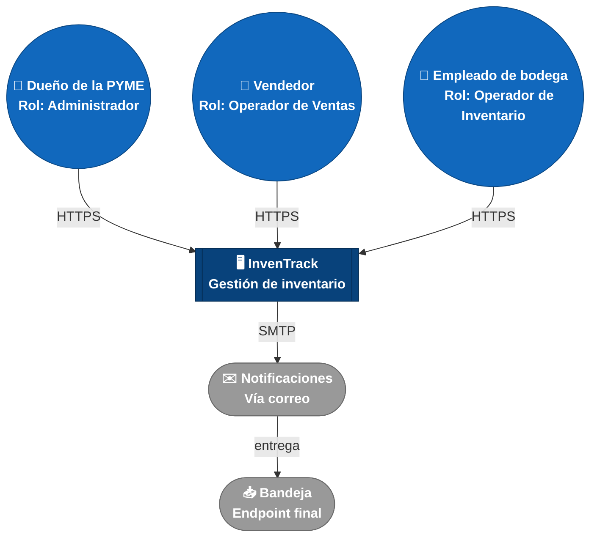

# C4 Nivel 1 — Diagrama de Contexto — InvenTrack

## Qué muestra este nivel y por qué

El modelo C4 documenta la arquitectura en niveles de zoom: Contexto
(Nivel 1) → Contenedores (Nivel 2) → Componentes (Nivel 3) → Código
(Nivel 4). Cada nivel abstrae detalle del anterior en vez de repetirlo.

Este diagrama es el **Nivel 1: Contexto**. Responde una sola pregunta:
*¿quién usa el sistema y con qué otros sistemas se conecta?* Por diseño,
**no** muestra nada de lo que hay adentro de InvenTrack (eso es el Nivel 2, Contenedores [`c4/containers.md`](./containers.md)).

Este diagrama se mantiene como **código Mermaid**, no como imagen, para
que sea versionable y editable directamente en el repositorio.

## Leyenda

| Símbolo | Forma | Color (hex) | Significado |
|---|---|---|---|
| 👤 | Círculo doble | Azul medio `#1168bd` | **Persona** — actor humano que usa el sistema |
| 🖥️ | Rectángulo de doble borde | Azul oscuro `#08427b` | **Sistema** — InvenTrack, el proyecto que estamos documentando |
| ✉️ / 📥 | Óvalo (estadio) | Gris `#999999` | **Externo** — sistema o endpoint fuera de nuestro control |

> **Nota sobre la convención de color:** el estándar original del modelo
> C4 (Simon Brown / Structurizr) usa persona en azul oscuro y sistema en
> azul medio. Aquí se invierte a pedido del curso, para que el sistema en
> desarrollo (InvenTrack) resalte visualmente como protagonista del
> diagrama.
>
> **Nota sobre las formas:** Mermaid no permite insertar íconos
> personalizados dentro de los nodos (como las insignias circulares con
> silueta rellena de un diagrama C4 profesional hecho a mano). Como
> alternativa dentro de lo que el código sí puede hacer, cada tipo de
> elemento usa una **forma de nodo distinta** (círculo doble para
> personas, rectángulo de doble borde para el sistema, óvalo para lo
> externo) combinada con un emoji, para que la distinción sea reconocible
> de un vistazo sin depender solo del color.

## Roles y actores, explicados uno por uno

| Actor | Tipo | Rol en el sistema | Qué hace | Por qué está en el diagrama |
|---|---|---|---|---|
| Dueño de la PYME | Persona | **Administrador** | Gestiona usuarios, proveedores y catálogo de productos; consulta reportes e historial completo de movimientos. | Es el interesado principal (ver Stakeholders en el arc42): sin su rol, no habría razón de negocio para el sistema. |
| Vendedor | Persona | **Operador de Ventas** | Registra salidas de inventario por venta; consulta stock actual. | Dispara el escenario de mayor prioridad del proyecto (ESC-01): dos operadores registrando salidas al mismo tiempo es la situación que pone a prueba la Consistencia de datos. |
| Empleado de bodega | Persona | **Operador de Inventario** | Registra entradas de mercancía y ajustes de inventario. | Junto con Vendedor, es el segundo actor que puede generar concurrencia sobre el mismo producto (ESC-01), y es quien opera físicamente el almacén. |
| InvenTrack | Sistema (este proyecto) | — | Centraliza productos, proveedores, movimientos de inventario, usuarios y alertas de stock bajo. | Es el sistema que se está documentando; en este nivel se trata como caja cerrada a propósito. |
| Notificaciones | Sistema externo | — | Recibe la solicitud de alerta cuando un producto baja del umbral crítico y la entrega por correo electrónico. | Es el único sistema externo real del MVP: sin él, la funcionalidad "alertas de stock bajo" (declarada en el alcance de la ficha del problema) no se podría entregar. |
| Bandeja | Endpoint | — | Bandeja de correo donde finalmente llega la alerta (del Dueño, Vendedor o Empleado, según a quién se configure notificar). | Cierra el ciclo de la notificación: sin este endpoint, "Notificaciones" quedaría como una caja que solo recibe, sin mostrar a dónde entrega. |

**Por qué tres roles y no solo "Dueño" y "Empleado":** el escenario ESC-05
(control de acceso por rol, en la sección Quality Requirements del arc42)
exige verificar permisos sobre roles específicos. Con solo dos actores
genéricos, "Dueño" y "Administrador" terminaban confundiéndose como si
fueran roles distintos sin serlo realmente. Separar Vendedor y Empleado
de bodega, y nombrar el rol de cada uno explícitamente (Administrador,
Operador de Ventas, Operador de Inventario), elimina esa ambigüedad y
deja los tres roles de ESC-05 con un actor real detrás de cada uno.

## Por qué se eligieron esos protocolos en las flechas

- **HTTPS** entre las personas e InvenTrack: es el protocolo estándar para
  cualquier interfaz web, y es consistente con la restricción C5 (sin
  presupuesto para servicios de pago) — no requiere licencias ni
  infraestructura adicional. También conecta con la restricción C1 (Ley
  1581 de 2012): HTTPS cifra los datos en tránsito, protegiendo
  credenciales y datos personales.
- **SMTP** hacia Notificaciones: protocolo estándar de envío de correo;
  se mantiene simple porque la decisión de stack (y si se usa un
  proveedor transaccional con API propia en vez de SMTP directo) todavía
  está pendiente — se documentará como ADR cuando se decida.
