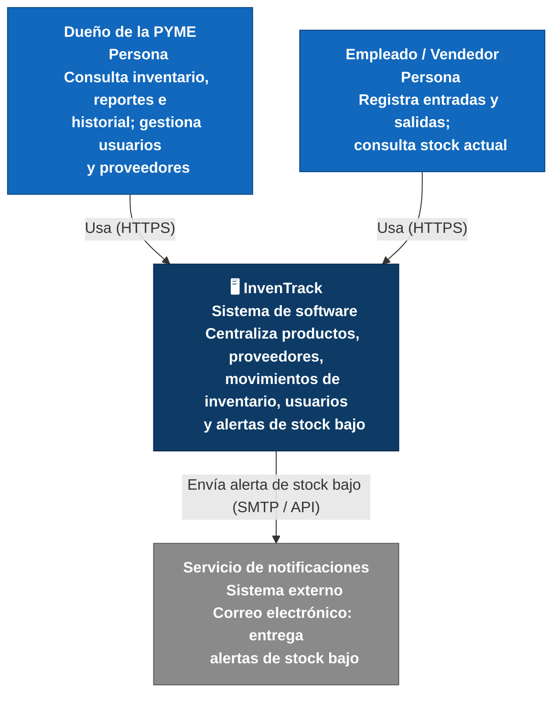

# C4 Nivel 1 — Diagrama de Contexto — InvenTrack

Este diagrama muestra el sistema InvenTrack como una caja única, sus dos
actores humanos y el único sistema externo con el que se comunica. Es el
nivel más alto de la notación C4: no muestra componentes internos, solo
"quién usa el sistema y con qué se conecta".

**Leyenda:** azul claro = persona, azul oscuro = el sistema InvenTrack,
gris = sistema externo.

## Actores y sistemas

| Actor / sistema | Tipo | Interacción con InvenTrack |
|---|---|---|
| Dueño de la PYME | Persona | Consulta inventario, reportes e historial de movimientos; gestiona usuarios y proveedores. |
| Empleado / vendedor | Persona | Registra entradas y salidas de mercancía; consulta stock actual. |
| InvenTrack | Sistema (este proyecto) | Centraliza productos, proveedores, movimientos de inventario, usuarios y alertas de stock bajo. |
| Servicio de notificaciones (correo electrónico) | Sistema externo | Recibe la solicitud de alerta cuando un producto baja del umbral crítico y la entrega al destinatario. |

**Nota:** el Proveedor es un interesado indirecto — sus datos (catálogo,
órdenes) los ingresan manualmente el Dueño o el Empleado dentro de
InvenTrack. No hay integración directa con sistemas de proveedores en el
MVP, por lo que no aparece como actor externo en este diagrama.
