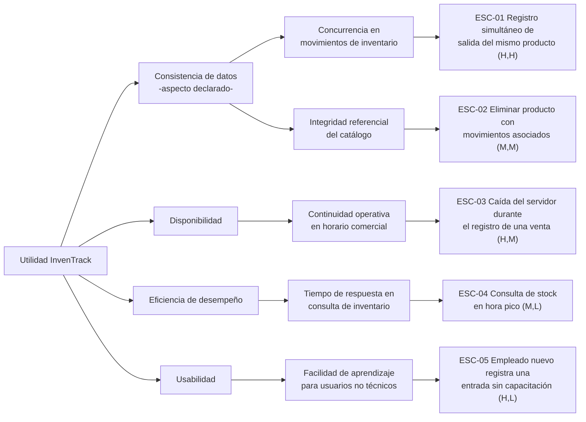

# Árbol de utilidad — InvenTrack

Priorización como (impacto en el negocio, riesgo técnico). H = alto,
M = medio, L = bajo.

```mermaid
graph LR
    U[Utilidad InvenTrack]

    U --> QA1[Consistencia de datos<br/>-aspecto declarado-]
    U --> QA2[Disponibilidad]
    U --> QA3[Eficiencia de desempeño]
    U --> QA4[Usabilidad]

    QA1 --> R1[Concurrencia en<br/>movimientos de inventario]
    QA1 --> R2[Integridad referencial<br/>del catálogo]
    QA2 --> R3[Continuidad operativa<br/>en horario comercial]
    QA3 --> R4[Tiempo de respuesta en<br/>consulta de inventario]
    QA4 --> R5[Facilidad de aprendizaje<br/>para usuarios no técnicos]

    R1 --> S1["ESC-01 Registro simultáneo de\nsalida del mismo producto (H,H)"]
    R2 --> S2["ESC-02 Eliminar producto con\nmovimientos asociados (M,M)"]
    R3 --> S3["ESC-03 Caída del servidor durante\nel registro de una venta (H,M)"]
    R4 --> S4["ESC-04 Consulta de stock\nen hora pico (M,L)"]
    R5 --> S5["ESC-05 Empleado nuevo registra una\nentrada sin capacitación (H,L)"]
```
