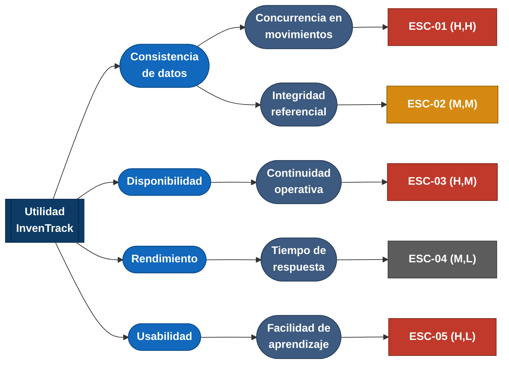

# Árbol de utilidad — InvenTrack

El árbol de utilidad organiza la discusión de calidad: de la utilidad
general del sistema, se desprenden los atributos de calidad, luego un
refinamiento de cada uno, y por último el escenario concreto y medible que
lo prueba. Cada escenario se prioriza como **(impacto en el negocio,
riesgo técnico)**, con H = alto, M = medio, L = bajo.

Rojo = prioridad alta · Ámbar = prioridad media · Gris = prioridad baja

## Detalle de cada escenario

| ID | Atributo | Refinamiento | Prioridad (negocio, riesgo) | Por qué esta prioridad |
|---|---|---|---|---|
| ESC-01 | Consistencia de datos *(aspecto declarado)* | Concurrencia en movimientos de inventario | **(H, H)** | Es el aspecto declarado del proyecto: un stock negativo o un doble descuento rompe la confianza del dueño en el sistema desde el primer uso, y la solución técnica (control de concurrencia) no es trivial. |
| ESC-02 | Consistencia de datos | Integridad referencial del catálogo | (M, M) | Afecta la trazabilidad histórica si se permite borrar productos con movimientos, pero el impacto es menor y la solución (borrado lógico) es directa. |
| ESC-03 | Disponibilidad | Continuidad operativa en horario comercial | **(H, M)** | Si el sistema cae en horario comercial, el negocio pierde la venta o vuelve al papel; el riesgo técnico es medio porque depende de la infraestructura de despliegue, aún por confirmar. |
| ESC-04 | Rendimiento | Tiempo de respuesta en consulta de inventario | (M, L) | Importa para la experiencia de uso en el mostrador, pero el volumen de datos de una PYME es pequeño, así que el riesgo técnico de no cumplirlo es bajo. |
| ESC-05 | Usabilidad | Facilidad de aprendizaje para usuarios no técnicos | **(H, L)** | Los usuarios objetivo vienen de Excel o papel: si la curva de aprendizaje es alta, el sistema simplemente no se adopta. El riesgo técnico es bajo porque es una decisión de diseño de interfaz, no de arquitectura compleja. |

Los escenarios con impacto de negocio alto (ESC-01, ESC-03, ESC-05) son
los que primero deben orientar decisiones arquitectónicas concretas
(ADR). ESC-01 tiene además riesgo técnico alto, por lo que es el
candidato natural para la primera decisión documentada del proyecto.
