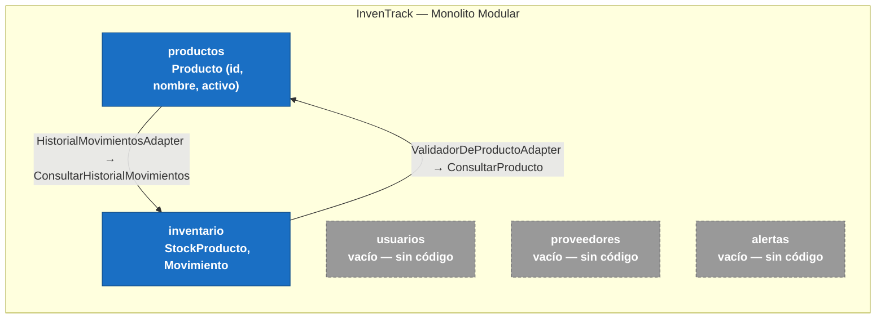

# Mapa de contextos — InvenTrack

Vista de los *bounded contexts* del monolito modular (cada carpeta bajo
`app/<modulo>/` es un contexto, según [ADR-0001](adr/0001-usar-monolito-modular-con-hexagonal-por-modulo.md)).
No es un diagrama C4 — el C4 (`docs/c4/`) muestra contenedores desplegables;
este muestra los límites de dominio y cómo se relacionan entre sí.

## Qué muestra

- **`productos` e `inventario`** (azul): los únicos dos contextos con código
  real. Desde el [ADR-0003](adr/0003-integracion-productos-inventario-via-puertos-de-aplicacion.md)
  se hablan en ambas direcciones, pero **solo a través de la capa
  `application`** del otro — ninguno importa el `domain` ni la
  `infrastructure` del contrario, tal como exige el ADR-0001:
  - `productos → inventario`: `HistorialMovimientosAdapter` (en
    `productos/infrastructure/`) invoca `ConsultarHistorialMovimientos` de
    `inventario`, para que `EliminarProducto` sepa si el producto tiene
    movimientos asociados (ESC-02).
  - `inventario → productos`: `ValidadorDeProductoAdapter` (en
    `inventario/infrastructure/`) invoca `ConsultarProducto` de `productos`,
    para rechazar movimientos sobre productos inexistentes o inactivos.
- **`usuarios`, `proveedores`, `alertas`** (gris, borde discontinuo):
  paquetes creados pero sin ninguna línea de código todavía. `usuarios`
  respondería a ESC-05 (control de acceso por rol), hoy sin implementar.

## Dueño único de los datos

| Módulo | Dato que posee | ¿Dueño único respetado? |
|---|---|---|
| `productos` | `Producto` (id, nombre, activo) | Sí |
| `inventario` | `StockProducto` (producto_id, cantidad), `Movimiento` (historial) | Sí — y desde ADR-0003 valida el `producto_id` contra `productos` antes de escribir |
| `usuarios` | Usuario, roles (declarado en ESC-05) | No implementado |
| `proveedores` | Proveedor | No implementado |
| `alertas` | Alerta | No implementado |

## Historial

Antes del ADR-0003, `productos` e `inventario` no tenían ninguna relación en
el código: `inventario` aceptaba movimientos para cualquier `producto_id`
sin validarlo, y el check de "tiene movimientos asociados" de `productos`
se resolvía con un doble de prueba marcado a mano, no con datos reales de
`inventario`. Ese estado ya no aplica — se documenta aquí solo como
referencia de lo que cambió.