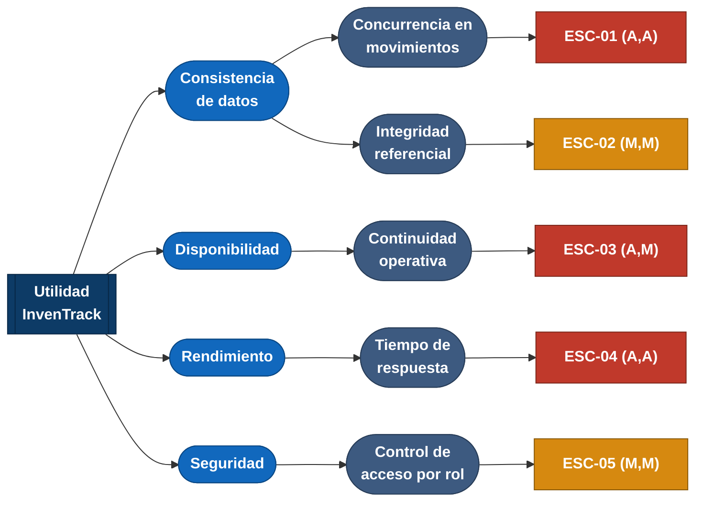

# Árbol de utilidad — InvenTrack

## Qué es y para qué sirve

El árbol de utilidad es la herramienta que usamos para pasar de "queremos
que el sistema sea bueno" a algo que realmente se puede construir y
probar. Se lee de izquierda a derecha, en cuatro niveles:

1. **Utilidad** — la raíz. Representa "que InvenTrack cumpla su propósito"
   en general; no se prioriza, es el punto de partida.
2. **Atributo de calidad** — en qué dimensión concreta se mide esa
   utilidad (Consistencia, Disponibilidad, Rendimiento, Seguridad...).
3. **Refinamiento** — una situación más específica dentro de ese
   atributo, porque "Consistencia" a secas todavía no se puede probar.
4. **Escenario** — la hoja del árbol. Es el nivel donde el atributo ya
   quedó convertido en algo medible: quién lo dispara, qué pasa, y con
   qué número se verifica.

Cada escenario se prioriza como **(impacto en el negocio, riesgo
técnico)**, con A = alto, M = medio, B = bajo. Esa priorización es la que
decide qué se ataca primero cuando el equipo empiece a tomar decisiones
de arquitectura (ADR).

## De dónde salen los atributos elegidos

Los atributos que aparecen en este árbol siguen el marco visto en clase
—"cinco atributos, cinco preguntas" (Rendimiento, Escalabilidad,
Disponibilidad, Mantenibilidad, Seguridad)— más el aspecto de calidad que
el equipo ya declaró en la Semana 1 (Consistencia de datos, que queda
fuera de ese marco de cinco porque es el aspecto central del proyecto, no
uno más de la lista).

De esas seis posibles ramas, priorizamos cuatro para esta entrega:
Consistencia, Disponibilidad, Rendimiento y Seguridad. Escalabilidad y
Mantenibilidad se identificaron pero no se desarrollaron en escenarios —
el detalle de por qué se puede ver en
[`docs/arc42/arc42-template-EN.md`](arc42/arc42-template-EN.md), sección
Quality Goals.

## El árbol

**Cómo leer los colores:** azul oscuro = la raíz (Utilidad); azul claro =
atributo de calidad; azul grisáceo = refinamiento; y en las hojas, rojo =
prioridad alta (impacto/riesgo crítico), ámbar = prioridad media.

## Detalle de cada escenario

| ID | Atributo | Refinamiento | Prioridad (negocio, riesgo) | Por qué esta prioridad |
|---|---|---|---|---|
| ESC-01 | Consistencia de datos *(aspecto declarado)* | Concurrencia en movimientos de inventario | **(A, A)** | Aspecto declarado del proyecto: 20 peticiones simultáneas sobre el mismo SKU deben procesarse atómicamente sin stock negativo. Abordado en el **ADR-0002**. |
| ESC-02 | Consistencia de datos | Integridad referencial del catálogo | (M, M) | Afecta la trazabilidad si se borran productos con movimientos. Resuelto mediante borrado lógico en el módulo de productos. |
| ESC-03 | Disponibilidad | Continuidad operativa en horario comercial | **(A, M)** | Si el sistema cae en horario comercial, el negocio pierde ventas. El riesgo es medio porque depende de la infraestructura de hosting. |
| ESC-04 | Rendimiento | Tiempo de respuesta bajo contención (Reto C1) | **(A, A)** | Requisito explícito del reto del Corte 1: latencia $p95 \le 400\text{ ms}$ durante picos de concurrencia. Validado con un resultado medido de $p95 = 28\text{ ms}$. |
| ESC-05 | Seguridad | Control de acceso por rol | (M, M) | Protección de datos personales conforme a la Ley 1581 de 2012 (restricción C1). El riesgo es medio según el mecanismo final de autenticación. |

## Qué hacer con esta priorización

Los escenarios en rojo **ESC-01 y ESC-04** representan el núcleo del Reto de Arquitectura del Primer Corte. Ambos fueron resueltos y ratificados mediante el **ADR-0002** (*Control de Concurrencia en Memoria*), demostrando la capacidad del monolito modular de responder de forma atómica y mantener latencias inferiores a los $400\text{ ms}$ bajo carga simultánea.
