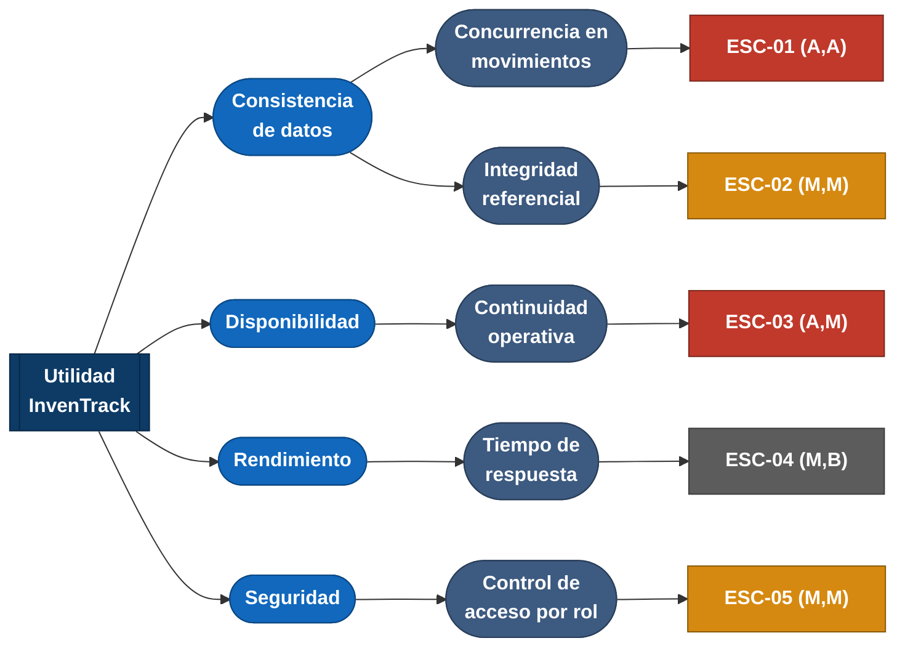

# Árbol de utilidad — InvenTrack

## Qué es y para qué sirve

El árbol de utilidad es la herramienta que usamos para pasar de "queremos
que el sistema sea bueno" a algo que realmente se puede construir y
probar. Se lee de izquierda a derecha, en cuatro niveles:

1. **Utilidad** — la raíz. Representa "que InvenTrack cumpla su propósito"
   en general; no se prioriza, es el punto de partida.
2. **Atributo de calidad** — en qué dimensión concreta se mide esa
   utilidad (Consistencia, Disponibilidad, Rendimiento, Seguridad...).
3. **Refinamiento** — una situación más específica dentro de ese
   atributo, porque "Consistencia" a secas todavía no se puede probar.
4. **Escenario** — la hoja del árbol. Es el nivel donde el atributo ya
   quedó convertido en algo medible: quién lo dispara, qué pasa, y con
   qué número se verifica.

Cada escenario se prioriza como **(impacto en el negocio, riesgo
técnico)**, con A = alto, M = medio, B = bajo. Esa priorización es la que
decide qué se ataca primero cuando el equipo empiece a tomar decisiones
de arquitectura (ADR).

## De dónde salen los atributos elegidos

Los atributos que aparecen en este árbol siguen el marco visto en clase
—"cinco atributos, cinco preguntas" (Rendimiento, Escalabilidad,
Disponibilidad, Mantenibilidad, Seguridad)— más el aspecto de calidad que
el equipo ya declaró en la Semana 1 (Consistencia de datos, que queda
fuera de ese marco de cinco porque es el aspecto central del proyecto, no
uno más de la lista).

De esas seis posibles ramas, priorizamos cuatro para esta entrega:
Consistencia, Disponibilidad, Rendimiento y Seguridad. Escalabilidad y
Mantenibilidad se identificaron pero no se desarrollaron en escenarios —
el detalle de por qué se puede ver en
[`docs/arc42/arc42-template-EN.md`](arc42/arc42-template-EN.md), sección
Quality Goals.

## El árbol

**Cómo leer los colores:** azul oscuro = la raíz (Utilidad); azul claro =
atributo de calidad; azul grisáceo = refinamiento; y en las hojas, rojo =
prioridad alta, ámbar = prioridad media, gris = prioridad baja. El color
de la hoja es lo que realmente importa para decidir por dónde empezar.

## Detalle de cada escenario

| ID | Atributo | Refinamiento | Prioridad (negocio, riesgo) | Por qué esta prioridad |
|---|---|---|---|---|
| ESC-01 | Consistencia de datos *(aspecto declarado)* | Concurrencia en movimientos de inventario |  **(A, A)** | Es el aspecto declarado del proyecto: un stock negativo o un doble descuento rompe la confianza del dueño en el sistema desde el primer uso, y la solución técnica (control de concurrencia) no es trivial — de ahí el riesgo también alto. |
| ESC-02 | Consistencia de datos | Integridad referencial del catálogo | (M, M) | Afecta la trazabilidad histórica si se permite borrar productos con movimientos, pero el impacto es menor que ESC-01 y la solución (borrado lógico en vez de físico) es directa. |
| ESC-03 | Disponibilidad | Continuidad operativa en horario comercial | **(A, M)** | Si el sistema cae en horario comercial, el negocio pierde la venta o vuelve al papel — impacto alto. El riesgo es medio, no alto, porque depende sobre todo de la infraestructura de despliegue, que aún está por confirmar (no es un problema de diseño complejo). |
| ESC-04 | Rendimiento | Tiempo de respuesta en consulta de inventario | (M, B) | Importa para la experiencia de uso en el mostrador, pero el volumen de datos de una sola PYME es pequeño, así que el riesgo técnico de no cumplir el umbral es bajo. |
| ESC-05 | Seguridad | Control de acceso por rol | (M, M) | La protección de datos personales es una restricción legal (Ley 1581 de 2012, ver restricción C1 en el arc42), no solo una preferencia de diseño — de ahí que no sea prioridad baja. El riesgo es medio porque el mecanismo de autenticación concreto todavía depende de una decisión de stack que no se ha tomado. |

## Qué hacer con esta priorización

Los escenarios en rojo (ESC-01, ESC-03) son los que tienen mayor impacto
de negocio y deberían orientar las primeras decisiones arquitectónicas
documentadas como ADR. Entre ellos, **ESC-01 tiene además riesgo técnico
alto**, lo que lo convierte en el candidato natural para la primera
decisión del proyecto: cómo se va a garantizar la consistencia en
movimientos concurrentes (transacciones con aislamiento adecuado,
bloqueos optimistas/pesimistas, o validaciones a nivel de base de datos).

**Nota sobre Usabilidad:** es relevante para el perfil de usuario descrito
en la ficha del problema (personas no técnicas, que hoy usan Excel o
papel), pero al aplicar este árbol no alcanzó la misma prioridad que
Seguridad esta semana, porque la protección de datos personales es además
una obligación legal que no se puede posponer. Usabilidad puede
convertirse en un aspecto propio, con sus propios escenarios, si el
equipo lo decide en semanas futuras.
